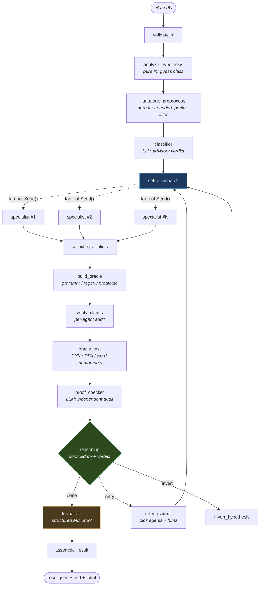
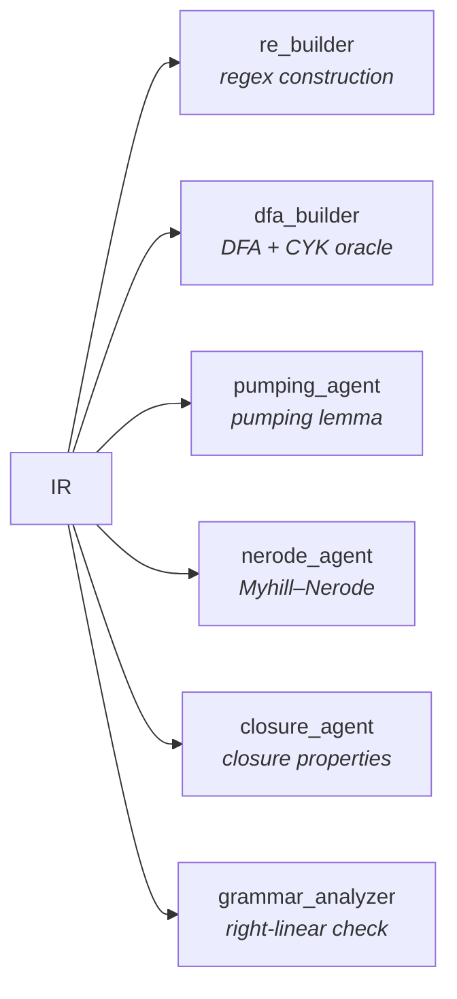
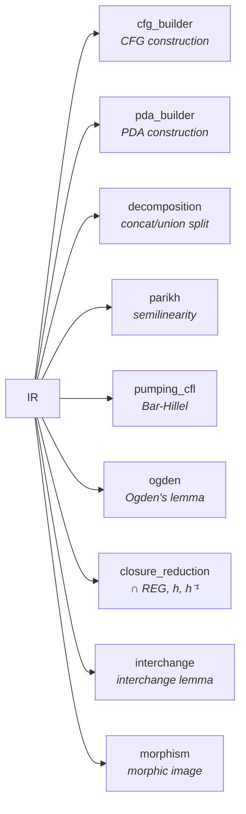
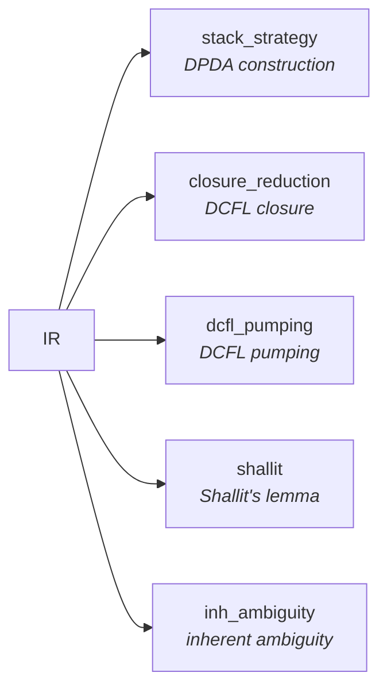
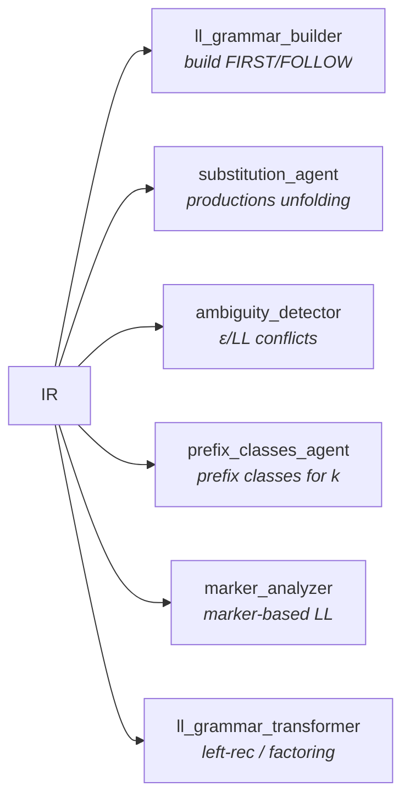

# TFL-automatisation

[](https://github.com/Ark2016/TFL-automatisation/actions/workflows/tests.yml)
[](LICENSE)
[](https://www.python.org/downloads/)
[](https://www.anthropic.com/claude)

Multi-agent pipelines for **Theory of Formal Languages** problems — classify a language and produce an exam-ready proof that it belongs (or does not belong) to a given complexity class. Four independent pipelines, one shared orchestration pattern, one local web UI.

> The system targets the formal languages course at **ИУ-9, МГТУ им. Баумана**. Inputs are Russian problem statements; outputs are structured Markdown / HTML / JSON reports with LaTeX-typeset proofs, grammar constructions, PDA diagrams, and case analyses.

---

## At a glance

| Pipeline | Language class | Agents | Flagship theorems |
|---|---|---|---|
| **REG** — `agent_system/` | Regular | 12 | Myhill–Nerode, pumping lemma (reg), closure under ⋃ ⋂ ¬ · * |
| **CFL** — `cfl_system/` | Context-free | 15 | Bar-Hillel pumping, Ogden's lemma, Parikh's theorem, interchange lemma, CFL ∩ REG |
| **DCFL** — `dcfl_system/` | Deterministic CFL | 8 | DCFL pumping, Shallit's lemma, inherent ambiguity |
| **LL** — `ll_system/` | LL(k) grammars | 10 | FIRST / FOLLOW, LL(k) conflict detection, left-recursion and factoring transforms |

Each pipeline runs **in parallel** over its specialist agents, fuses their results through a reasoning agent, audits the selected proof with an independent proof-checker, and formalizes the verdict via a structured Markdown document. See [Architecture](#architecture) below.

---

## Quickstart

```bash
# One-time setup
python -m venv .venv
.venv/Scripts/activate        # or source .venv/bin/activate on *nix
pip install -r requirements.txt   # anthropic, langgraph, python-dotenv, ...
echo "ANTHROPIC_API_KEY=sk-..." > .env

# Install Graphviz (for PDA state diagrams in HTML reports)
#   Windows: https://graphviz.org/download/ (add bin/ to PATH)
#   macOS:   brew install graphviz
#   Linux:   apt install graphviz
dot -V                        # sanity check

# Run the unified UI
.venv/Scripts/python -m ui_server.server --port 8765
# → open http://127.0.0.1:8765/
```

Or run a pipeline directly from the command line:

```bash
# Mock (no LLM, fast, free) — exercises validation + fallback reasoning
.venv/Scripts/python -m cfl_system.orchestrator \
    cfl_system/examples/task11_ai_bj_between.json \
    --save cfl_system/examples/live_outputs/

# Live (Anthropic API, real money)
.venv/Scripts/python -m cfl_system.orchestrator \
    cfl_system/examples/task11_ai_bj_between.json \
    --live --verbose \
    --save cfl_system/examples/live_outputs/
```

Artifacts land as `{task}_result.{json,md,html}` beside the IR.

---

## Architecture

Every pipeline is a **LangGraph `StateGraph`**, wired with the same topology. Specialists run concurrently via `Send()` fan-out; the reasoning agent consolidates their evidence; disagreements trigger a selective retry or a hypothesis inversion.



### Key properties

- **Fan-out parallelism.** All specialists are dispatched in one `Send()` burst and run concurrently in LangGraph's Pregel thread pool. End-to-end wall time ≈ max(specialist time), not sum.
- **Selective retry.** `retry_planner` can re-dispatch a subset of agents with specific hints (e.g. "try pumping word $a^p b^p c^p$ instead of $a^{2p}$") without re-running the whole pipeline.
- **Hypothesis inversion.** If every specialist under the current guess (`cfl` / `non_cfl`) fails, `invert_hypothesis` flips the hypothesis and restarts the dispatch. Bounded by `MAX_INVERSIONS`.
- **Honest verification.** `proof_verified: true` is set **only** if `proof_checker` actually ran and returned `status = verified`. Agent errors, API failures, and JSON-parse problems are tracked in `state["errors"]` and surfaced in the final result — no silent success.

### Live-runner reliability layer

The [`LiveRunner`](cfl_system/orchestrator.py) (same pattern across all four pipelines) handles the messy reality of calling a frontier LLM in production:

```
Opus response → _extract_json (3 strategies: whole / fenced / braces)
              ├─ success → return parsed dict
              └─ failure → Haiku repair (claude-haiku-4-5, ~$0.01, ~2s)
                         ├─ success → return parsed dict
                         └─ failure → Opus retry with detailed parse-error
                                      (position + context snippet + prior
                                       response excerpt) up to N times
                                      └─ final failure → agent_error dict
                                         with errors recorded in state
```

- **Streaming API** is mandatory — non-streaming requests are rejected by the Anthropic SDK when `max_tokens × projected latency > 10 min`, which the older 4096-token runs silently hit on formalizer / proof_checker.
- **Temperature handled per model.** Opus 4.7 (adaptive thinking) deprecated `temperature`; LiveRunner drops it for that model via an allow-list.

---

## The four pipelines

### REG — `agent_system/`

Classify a regular-language problem and prove it (or disprove regularity). Specialists:



**Theorems / methods:**

- **Myhill–Nerode theorem.** Infinite-rank right-congruence → not regular.
- **Pumping lemma.** For non-regularity: choose word $z$, case analysis on partitions $z = uvw$.
- **Closure under boolean ops + concatenation + star.** Reduce unknown language to a known one via $L \cup R$, $L \cap R$, $\overline{L}$, $h^{-1}(L)$.
- **Grammar analysis.** Right-linear grammars generate exactly regular languages.

Formalizer can emit **Lean 4** proof stubs in addition to Markdown (optional, gated by availability of a Lean build).

### CFL — `cfl_system/`

Classify a context-free problem. Full specialist cast:



**Theorems / methods:**

- **Bar-Hillel pumping lemma.** For non-CFL: every long enough $z \in L$ decomposes as $uvwxy$ with $|vwx| \le p$ and $|vx| \ge 1$, and $u v^i w x^i y \in L$ for all $i \ge 0$. Case split on where $vwx$ falls.
- **Ogden's lemma.** Strengthened pumping with marked positions — catches non-CFLs that survive plain pumping.
- **Parikh's theorem.** Parikh image of any CFL is semilinear (a finite union of linear sets). Non-semilinear image $\Rightarrow$ language is not CFL. Used to knock out languages like $\{a^n b^m : n = k^2\}$ via Ginsburg–Spanier.
- **Closure under ∩ REG.** If $L$ is CFL and $R$ is regular, $L \cap R$ is CFL. Contrapositive: intersect with a carefully chosen regex, then apply pumping to the simpler intersection.
- **Interchange lemma, morphism closure.** Fallback attacks when the above are inconclusive.
- **CYK oracle.** Pure-function membership test for the proposed CFG, validated against ≥3 positive and ≥3 negative words.

### DCFL — `dcfl_system/`

Classify a deterministic-context-free problem. Fewer specialists, each heavier:



**Theorems / methods:**

- **DCFL pumping lemma.** Unlike CFL pumping, bounds `|uv|` instead of just `|vwx|` — tighter, catches DCFL-but-not-REG distinctions.
- **Shallit's lemma.** Counting-based tool: if specific ratios of letter frequencies force an unbounded stack state, the language cannot be DCFL.
- **Inherent ambiguity arguments.** A DCFL is unambiguous; demonstrate two distinct parse trees for the same word to rule DCFL out.
- **Closure under complement (DCFL-specific).** DCFLs are closed under complement but CFLs are not — useful discriminator.

### LL — `ll_system/`

Classify a grammar as LL(k) for some bounded k, detect conflicts, suggest transformations.



**Theorems / methods:**

- **FIRST / FOLLOW sets.** Computed per-nonterminal; the LL(1) test is $\text{FIRST}(\alpha_i) \cap \text{FIRST}(\alpha_j) = \emptyset$ for every pair of productions of the same nonterminal, plus a FOLLOW-disjointness condition when $\varepsilon$ is derivable.
- **LL(k) generalization.** For $k > 1$, prefix classes of length $k$ must be pairwise disjoint.
- **Grammar transformations.** Left-recursion elimination, left-factoring — makes a non-LL(1) grammar potentially LL(1), detected by `ll_grammar_transformer`.
- **First/Follow oracle.** Pure-function computation used both for verification and as an independent source of truth against the LLM-proposed sets.

---

## Models and cost structure

All four pipelines use the same three-tier model stack:

| Role | Model (alias) | Rate (input / output) | Used by |
|---|---|---|---|
| Heavy reasoning | `claude-opus-4-7` | $5 / $25 per MTok | All specialists, reasoning, proof_checker, formalizer |
| Fast structured | `claude-sonnet-4-6` | $3 / $15 per MTok | `classifier`, `retry_planner`, `input_parser` |
| JSON repair | `claude-haiku-4-5` | $1 / $5 per MTok | `_repair_json_with_haiku` hook in `LiveRunner` |

**Actual run cost** of the CFL pipeline on a medium problem (`task_w1bw2w3_ticket50.json`, closure_reduction + pumping, proof_checker verified): **≈ $2–3**. Simple problems (single-path, short proof) come in at **≈ $1**.

> Opus 4.7 uses **adaptive thinking** — it picks its reasoning depth per query and does **not** accept the `temperature` parameter. `LiveRunner._model_accepts_temperature()` is an allow-list that drops the field for models that reject it.

---

## TFL Lab — local web UI

[`ui_server/`](ui_server/) serves a single-page workspace for running any pipeline against any IR in the browser.

- **Sidebar:** project switcher (REG / CFL / DCFL / LL) + `examples/*.json` file list
- **Editor:** monospace IR editor with live JSON validator and line gutter
- **Run bar:** `Mock Run` (free, no LLM) and `Live Run` (gated by an explicit "I confirm API spend" checkbox with red border)
- **Result pane:** four tabs — HTML (iframe of the rendered report with KaTeX + inline Graphviz SVG), JSON (formatted), Markdown (Preview ↔ Raw GitHub-style toggle), Log (streamed stderr, color-coded)

Backend is stdlib-only (`http.server` + `ThreadingHTTPServer`); frontend is vanilla JS + CDN-loaded [marked](https://marked.js.org/) + [KaTeX](https://katex.org/). No framework, no build step.

```bash
.venv/Scripts/python -m ui_server.server --port 8765
# → http://127.0.0.1:8765/
```

---

## Repository layout

```
.
├── agent_system/           # REG pipeline
│   ├── orchestrator.py     # LangGraph StateGraph + LiveRunner
│   ├── config.py           # models + max_tokens per agent
│   ├── prompts/            # system prompts (one per agent)
│   ├── lib/                # oracle, IR schema, renderer, word generator
│   ├── examples/           # task IRs
│   ├── templates/          # Lean 4 proof templates
│   └── tests/              # pytest suite
├── cfl_system/             # CFL pipeline (same layout)
├── dcfl_system/            # DCFL pipeline (same layout)
├── ll_system/              # LL pipeline (same layout)
├── ui_server/              # TFL Lab web UI
│   ├── server.py           # stdlib http.server
│   ├── static/index.html   # single-page frontend
│   └── __init__.py
├── pumping_regular/        # Legacy standalone pumping tool (reference)
├── reverse_morfism/        # Legacy inverse-homomorphism solver
├── pumping_len.py          # Standalone min pumping-length finder for regex
├── .env                    # ANTHROPIC_API_KEY (git-ignored)
└── README.md               # you are here
```

Each pipeline follows the same module contract — if you can read one, you can read all four.

---

## Tests

Pure-function modules have full pytest coverage; LLM-driven layers are covered by mock-mode integration tests.

```bash
.venv/Scripts/python -m pytest agent_system/tests cfl_system/tests \
                               dcfl_system/tests ll_system/tests -q
# → 1294 passed, 3 skipped (as of current HEAD)
```

The 3 skipped tests exercise MockRunner against `%TEMP%` on Windows and skip in sandboxed CI environments.

---

## External dependencies

- **Python 3.12+** — `anthropic`, `langgraph`, `python-dotenv`, `pytest`
- **Graphviz `dot` binary** — rendering PDA state diagrams as inline SVG in HTML reports. Falls back to [Mermaid](https://mermaid.js.org/) via CDN if `dot` is absent. See [`cfl_system/CLAUDE.md`](cfl_system/CLAUDE.md) for install notes.
- **Lean 4** (optional) — REG pipeline can emit Lean stubs via `agent_system/templates/*.lean`.
- **Anthropic API key** in `.env` for `--live` runs. Mock mode works offline.

---

## Design non-goals

- **Not a solver for arbitrary undecidable questions.** All four pipelines assume the input is a well-posed problem from the exam problem set — the class being tested is decidable or admits a standard proof technique.
- **Not a formal proof assistant.** Proofs are natural-language Markdown; the `proof_checker` agent is an independent LLM audit, not a machine-checked verification. Lean stubs (REG only) are the closest this project gets to machine-checked proofs, and even those are opt-in.
- **No multi-user state.** TFL Lab binds to `127.0.0.1` and has no auth. It is a single-user research tool.

---

## License

[MIT](LICENSE) — use, modify, distribute freely. Provided as-is, with no warranty.

## Acknowledgements

Built for the Theory of Formal Languages course at **МГТУ им. Н.Э. Баумана, ИУ-9**.

Powered by [Claude](https://www.anthropic.com/claude) (Opus 4.7 / Sonnet 4.6 / Haiku 4.5) via the Anthropic API, orchestrated through [LangGraph](https://langchain-ai.github.io/langgraph/).
