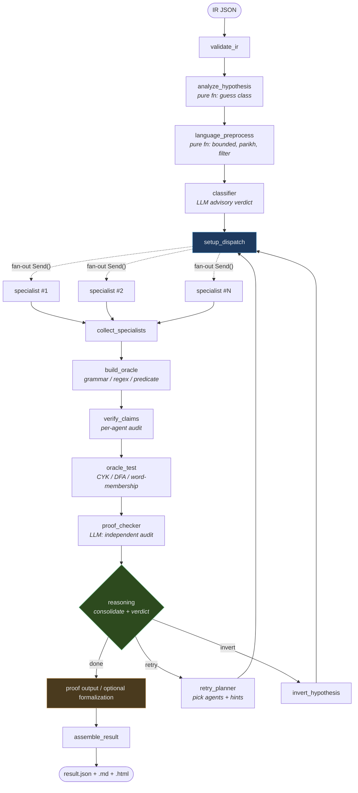
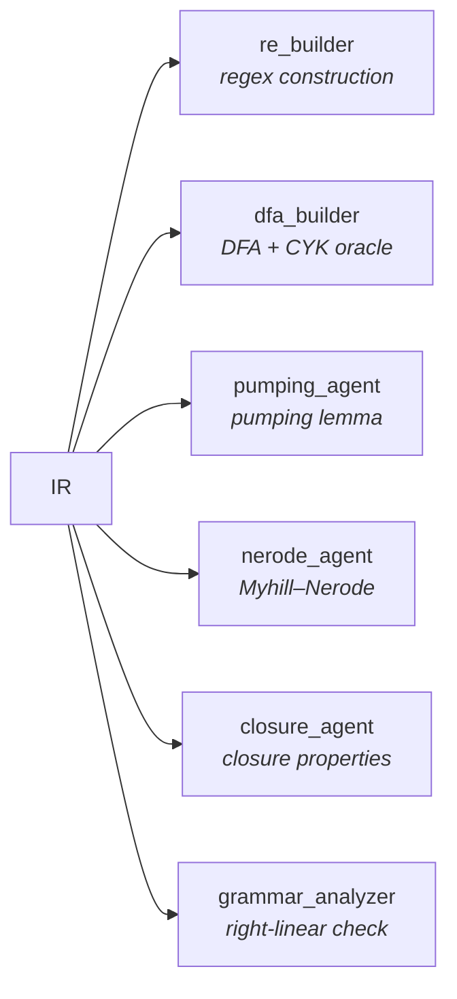
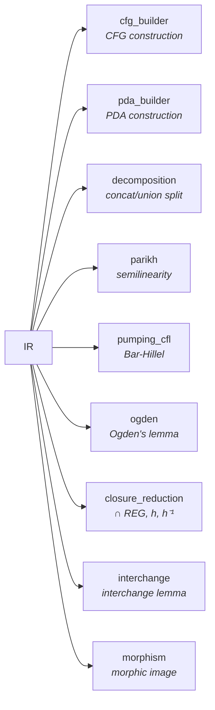
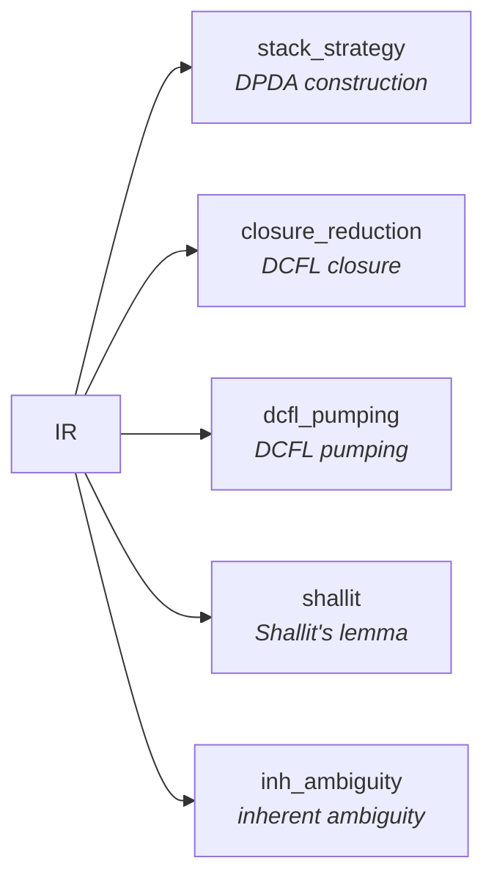
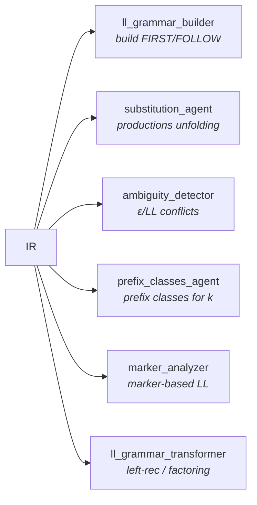

# TFL-automatisation

[](https://github.com/Ark2016/TFL-automatisation/actions/workflows/tests.yml)
[](LICENSE)
[](https://www.python.org/downloads/)
[](https://www.anthropic.com/claude)

Multi-agent pipelines for **Theory of Formal Languages** problems — classify a language and produce an exam-ready proof that it belongs (or does not belong) to a given complexity class. Four independent pipelines, one shared orchestration pattern, one local web UI.

> The system targets the formal languages course at **ИУ-9, МГТУ им. Баумана**. Inputs are Russian problem statements; outputs are structured Markdown / HTML / JSON reports with LaTeX-typeset proofs, grammar constructions, PDA diagrams, and case analyses.

Offline HTML guides (Russian): [ticket 50 and Lean explained](docs/examples/cfl_ticket50_w1bw2w3_lean_proved/walkthrough.html),
[interactive architecture audit](docs/architecture_explorer.html), and
[September 30 fixes, source checks and validation](docs/audit_fixes_2026-09-30.html).
The subsequent [theory audit with searchable findings](docs/theory_audit_2026-09-30.html)
covers additional mathematical and implementation corrections; see the
[theorem and source registry](docs/THEORY_REFERENCE.md) for exact hypotheses and source-reading limits.
The architecture guide preserves the pre-fix snapshot; the last report records the corrected behavior and remaining limits.

---

## At a glance

| Pipeline | Language class | Agents | Flagship theorems |
|---|---|---|---|
| **REG** — `agent_system/` | Regular | 12 | Myhill–Nerode, pumping lemma (reg), closure under ⋃ ⋂ ¬ · * |
| **CFL** — `cfl_system/` | Context-free | 15 | Bar-Hillel pumping, Ogden's lemma, Parikh's theorem, interchange lemma, CFL ∩ REG |
| **DCFL** — `dcfl_system/` | Deterministic CFL | 8 | DCFL pumping, Shallit's lemma, inherent ambiguity |
| **LL** — `ll_system/` | LL(k) grammars | 10 | FIRST / FOLLOW, LL(k) conflict detection, left-recursion and factoring transforms |

Each pipeline runs its specialist agents **in parallel**, checks their artifacts against deterministic oracles, and fuses the evidence through a reasoning agent into a verdict and a structured report. REG and CFL also run an independent LLM proof-checker; its self-assessment alone does not establish `proof_verified`. See [Architecture](#architecture) below.

---

## Quickstart

```bash
# One-time setup
python -m venv .venv
.venv/Scripts/activate        # or source .venv/bin/activate on *nix
pip install -e .                  # anthropic, langgraph, python-dotenv, ...
pip install pytest                # for the test suite
echo "ANTHROPIC_API_KEY=sk-..." > .env

# `pip install -e .` also registers console scripts, so any of these work
# from anywhere in the venv instead of `python -m ...`:
#   tfl-lab   tfl-reg   tfl-cfl   tfl-dcfl   tfl-ll

# Install Graphviz (for PDA state diagrams in HTML reports)
#   Windows: https://graphviz.org/download/ (add bin/ to PATH)
#   macOS:   brew install graphviz
#   Linux:   apt install graphviz
dot -V                        # sanity check

# Run the unified UI
.venv/Scripts/python -m ui_server.server --port 8765
# → open http://127.0.0.1:8765/
```

Or run a pipeline directly from the command line. All four orchestrators share one CLI contract — `<ir.json> --save DIR [--live] [--verbose]` — which is also what TFL Lab uses:

```bash
# Offline (no LLM, free) — exercises validation, oracles and fallback reasoning
.venv/Scripts/python -m cfl_system.orchestrator \
    cfl_system/examples/task11_ai_bj_between.json \
    --save cfl_system/examples/live_outputs/

# Live, cheap: every agent on Haiku (use this for testing)
TFL_MODEL_OVERRIDE=claude-haiku-4-5 .venv/Scripts/python -m cfl_system.orchestrator \
    cfl_system/examples/task11_ai_bj_between.json \
    --live --verbose --save cfl_system/examples/live_outputs/

# Live with the production models (Opus 5.5 / Sonnet 5.5 — real money)
.venv/Scripts/python -m cfl_system.orchestrator \
    cfl_system/examples/task11_ai_bj_between.json \
    --live --verbose --save cfl_system/examples/live_outputs/
```

Module per pipeline: `agent_system` (REG, run as `python -m agent_system`), `cfl_system.orchestrator`, `dcfl_system.orchestrator`, `ll_system.orchestrator`. `--mock DIR` replays recorded agent outputs instead of calling the API.

Artifacts land as `{ir_stem}_result.{json,md,html}` in the `--save` directory; the JSON has a top-level `verdict`. Exit code (cfl / dcfl / ll): `0` decided, `2` inconclusive, `1` failure; REG: `0` unless the pipeline failed.

---

## Architecture

Every pipeline is a **LangGraph `StateGraph`** built on a shared pattern: specialists run concurrently via `Send()` fan-out, deterministic checks inspect their artifacts, and a reasoning agent consolidates the evidence; disagreements can trigger a retry. This is a conceptual overview, not the exact node order of each graph. See the REG path below and [Pipeline differences](#pipeline-differences).


```mermaid
flowchart TD
    IR([IR JSON]) --> V[validate_ir]
    V --> H[analyze_hypothesis<br/><i>pure fn: guess class</i>]
    H --> LP[language_preprocess<br/><i>pure fn: bounded, parikh, filter</i>]
    LP --> CL[classifier<br/><i>LLM advisory verdict</i>]
    CL --> D[setup_dispatch]

    D -.fan-out Send().-> S1[specialist #1]
    D -.fan-out Send().-> S2[specialist #2]
    D -.fan-out Send().-> SN[specialist #N]

    S1 --> CS[collect_specialists]
    S2 --> CS
    SN --> CS

    CS --> BO[build_oracle<br/><i>grammar / regex / predicate</i>]
    BO --> VC[verify_claims<br/><i>per-agent audit</i>]
    VC --> OT[oracle_test<br/><i>CYK / DFA / word-membership</i>]
    OT --> PC[proof_checker<br/><i>LLM: independent audit</i>]
    PC --> R{reasoning<br/><i>consolidate + verdict</i>}

    R -->|done| F[proof output / optional formalization]
    R -->|retry| RP[retry_planner<br/><i>pick agents + hints</i>]
    R -->|invert| INV[invert_hypothesis]

    RP --> D
    INV --> D

    F --> AR[assemble_result]
    AR --> END([result.json + .md + .html])

    style D fill:#1e3a5f,stroke:#4a90c0,color:#e6e8ec
    style R fill:#2d4a1e,stroke:#7acb9d,color:#e6e8ec
    style F fill:#4a3a1e,stroke:#d4a86a,color:#e6e8ec
```

The nodes represented as one proof-output stage above differ by pipeline. REG uses an opt-in Lean formalizer: code
renders the theorem statement from the input IR, and the LLM supplies only its proof body. CFL's normal formalizer
returns a structured `proof_document`; its optional Lean formalization is a separate step. DCFL has optional Lean
formalization without a normal informal formalizer. LL produces structured or plain-language proofs and has no Lean
path. Lean formalization is enabled per run with `--formalize`, or by default with `TFL_FORMALIZATION=1` (also
`true`/`yes`/`on`).

REG's actual graph order is: `validate_ir` → `analyze_hypothesis` → `run_classifier` →
`grammar_preprocess` → `setup_dispatch` → specialist fan-out and collection → `build_oracle` →
`verify_closure` → `verify_claims` → `oracle_test` → `run_proof_checker` → `run_reasoning` →
optional Lean `formalize` → `assemble_result`. In particular, the classifier runs before grammar preprocessing,
and closure verification follows oracle construction.

### Key properties

- **Fan-out parallelism.** Specialists are dispatched in one `Send()` burst and can run concurrently in LangGraph's Pregel thread pool. A process-wide semaphore limits concurrent API calls to 4 by default (`TFL_MAX_CONCURRENCY` changes the limit), so larger fan-outs run through multiple waves; elapsed time depends on the queue and each wave's call times, not just the slowest single specialist.
- **Selective retry.** `retry_planner` can re-dispatch a subset of agents with specific hints (e.g. "try pumping word $a^p b^p c^p$ instead of $a^{2p}$") without re-running the whole pipeline.
- **Hypothesis inversion.** If every specialist under the current guess (`cfl` / `non_cfl`) fails, `invert_hypothesis` flips the hypothesis and restarts the dispatch. Bounded by `MAX_INVERSIONS`.
- **Error tracking.** `proof_verified` comes from the verdict gate's `verified` trust basis, which can include deterministic verification such as a checked Lean proof; an LLM proof-checker self-assessment alone cannot set it. Agent errors, API failures, and JSON-parse problems are tracked in `state["errors"]` and surfaced in the final result.
- **Known limitations.** Claim verifiers that used to mark an agent claim `verified` for being merely well-formed now
  return `well_formed` (see trust taxonomy below); semantic (word-level) verification of the claim's content is only
  partial so far — implemented where an oracle already exists (CFL pumping/ogden/closure_reduction, DCFL pumping/Shallit,
  LL constructive/substitution/prefix_classes, REG pumping/Nerode), not yet for set_builder languages without a
  word-oracle. Treat a verdict's confidence per its `trust` level, not as a proof; see
  [`docs/VERDICT_POLICY.md`](docs/VERDICT_POLICY.md) §4.

- **Trust taxonomy and confidence caps.** Every artifact/claim carries a `trust` level, and the orchestrator caps the
  final `confidence` accordingly (full rules: [`docs/VERDICT_POLICY.md`](docs/VERDICT_POLICY.md)):

  | trust | meaning | confidence cap |
  |---|---|---|
  | `verified` | deterministic, complete check (LL(k) table, Lean proof w/o `sorry`, regex/DFA regularity) | 0.98 |
  | `bounded_pass` | deterministic but bounded check (oracle membership up to length L, sampled grammar equivalence) | 0.85 |
  | `well_formed` | structure only — fields present, JSON/words parsed | 0.55 |
  | `not_verified` | check impossible or fields missing (verdict must be `inconclusive`/`uncertain`) | 0.40 |
  | unresolved `contradiction` (constructive vs. destructive evidence) | — | 0.50 |

  The result's `verdict_gate` block (`basis`, `contradiction`, `downgrades`, `confidence_cap`) records which trust
  levels backed the verdict and any downgrade the gate applied; renderers label evidence in words (`verified` /
  `bounded_pass` / `well_formed` / `refuted`) rather than a blanket green "verified" banner.

  Checking a pumping argument at selected fixed values of `p` is diagnostic only; it does not raise trust for a
  universal non-CFL or non-DCFL claim.

### Pipeline differences

| Stage | REG | CFL | DCFL | LL |
|---|:-:|:-:|:-:|:-:|
| Classifier (advisory) | ✓ | ✓ | ✓ | ✓ |
| Deterministic oracle | DFA / regex | CYK + PDA simulation | word sampler + verifier | FIRST_k / FOLLOW_k table |
| Claim verification | ✓ | ✓ | ✓ | ✓ |
| `proof_checker` agent | ✓ | ✓ | — | — |
| Retry | LLM planner | LLM planner | rule-based | reasoning-driven |
| Hypothesis inversion | ✓ | ✓ | — | — |
| Proof output / formalization | Lean proof body from IR-fixed statement (opt-in) | Structured `proof_document`; optional Lean step | Optional Lean step only | Structured/plain-language proof; no Lean |

### Live-runner reliability layer

The [`LiveRunner`](cfl_system/orchestrator.py) (same pattern in cfl / dcfl / ll; REG uses [`LLMRunner`](agent_system/lib/llm_client.py)) handles the messy reality of calling a frontier LLM:

```
Opus response → _extract_json (3 strategies: whole / fenced / braces)
              ├─ success → return parsed dict
              └─ failure → Haiku repair (claude-haiku-4-5, ~$0.01, ~2s)
                         ├─ success → return parsed dict
                         └─ failure → Opus retry with detailed parse-error
                                      (position + context snippet + prior
                                       response excerpt) up to N times
                                      └─ final failure → agent_error dict
                                         with errors recorded in state
```

- **Streaming API** everywhere — non-streaming requests are rejected by the Anthropic SDK when `max_tokens × projected latency > 10 min`, and with adaptive thinking `max_tokens` has to cover reasoning + answer (64K).
- **Request parameters per model.** Opus 5.5 / Sonnet 5.5 run adaptive thinking steered by a per-agent `effort` level (`EFFORT` in each `config.py`) and reject `temperature`; only legacy models (Haiku 4.5) get `temperature`. See `LiveRunner._build_request_kwargs()`.
- **Cheap live test runs.** `TFL_MODEL_OVERRIDE=claude-haiku-4-5` forces every agent onto one model (all four pipelines); production models stay in `config.py`.
- **Refusals.** A safety-classifier decline (`stop_reason="refusal"`) becomes an `agent_error` immediately — no JSON repair or retry. Opus 5.x calls opt into the server-side refusal fallback (`fallbacks: "default"`, toggle `REFUSAL_FALLBACK`).

**Shared client (`agent_system/lib/llm_client.py`).** `cfl_system`/`dcfl_system`/`ll_system`'s `LiveRunner` are now
thin wrappers around one `AnthropicClient`: `build_request_kwargs()` builds the thinking/effort/temperature kwargs
described above, and `call()` does one streamed request and returns a typed `CallResult` (text, `stop_reason`,
model, usage, refusal info). API errors are typed — `FatalAPIError` (400/401/403/404, never retried) vs
`RetryableAPIError` (429/5xx/overloaded/a broken stream, retried with jittered backoff) — and concurrent calls
across all four pipelines share one process-wide semaphore, sized by the `TFL_MAX_CONCURRENCY` env var. A
`UsageTracker` accumulates tokens/cache-hit/cost per run (`as_dict()`) and is now wired into each pipeline's
top-level result JSON and CLI `--verbose` output, so every run reports its own token/cost usage block.

**Structured outputs.** Agent responses are parsed primarily via the Messages API's `output_config.format`
(a closed per-agent JSON schema built by `build_agent_output_schema()` / `agent_output_schema.py` in each
system), which sidesteps the old "first `{` to last `}`" heuristic breaking on set-builder notation like
`{aⁿbⁿ | n≥0}` in prose. If the API rejects `output_config` itself (schema too large/unsupported), the call
transparently falls back to the legacy brace/fence extraction + Haiku repair path described above. Agents whose
output shape isn't a single fixed object (`input_parser`, `formalizer`, `ll_input_parser`) intentionally keep the
legacy prose-extraction path only.

---

## The four pipelines

### REG — `agent_system/`

Classify a regular-language problem and prove it (or disprove regularity). Specialists:


```mermaid
flowchart LR
    IR --> re[re_builder<br/><i>regex construction</i>]
    IR --> dfa[dfa_builder<br/><i>DFA + CYK oracle</i>]
    IR --> pump[pumping_agent<br/><i>pumping lemma</i>]
    IR --> ner[nerode_agent<br/><i>Myhill–Nerode</i>]
    IR --> clo[closure_agent<br/><i>closure properties</i>]
    IR --> gram[grammar_analyzer<br/><i>right-linear check</i>]
```

**Theorems / methods:**

- **Myhill–Nerode theorem.** Infinite-rank right-congruence → not regular.
- **Pumping lemma.** For non-regularity: choose word $z$, case analysis on partitions $z = uvw$.
- **Closure under boolean ops + concatenation + star.** Reduce unknown language to a known one via $L \cup R$, $L \cap R$, $\overline{L}$, $h^{-1}(L)$.
- **Grammar analysis.** Right-linear grammars generate exactly regular languages.

REG's opt-in formalizer writes only a Lean proof body for a theorem statement generated from the IR; it does not create a Markdown proof. The optional Lean step also exists in CFL and DCFL, with pipeline-specific behavior described above and in "R-Lean architecture" below.

### CFL — `cfl_system/`

Classify a context-free problem. Full specialist cast:


```mermaid
flowchart LR
    IR --> cfg[cfg_builder<br/><i>CFG construction</i>]
    IR --> pda[pda_builder<br/><i>PDA construction</i>]
    IR --> decomp[decomposition<br/><i>concat/union split</i>]
    IR --> pk[parikh<br/><i>semilinearity</i>]
    IR --> pump[pumping_cfl<br/><i>Bar-Hillel</i>]
    IR --> og[ogden<br/><i>Ogden's lemma</i>]
    IR --> clo[closure_reduction<br/><i>∩ REG, h, h⁻¹</i>]
    IR --> inter[interchange<br/><i>interchange lemma</i>]
    IR --> morph[morphism<br/><i>morphic image</i>]
```

**Theorems / methods:**

- **Bar-Hillel pumping lemma.** For non-CFL: every long enough $z \in L$ decomposes as $uvwxy$ with $|vwx| \le p$ and $|vx| \ge 1$, and $u v^i w x^i y \in L$ for all $i \ge 0$. Case split on where $vwx$ falls.
- **Ogden's lemma.** Strengthened pumping with marked positions — catches non-CFLs that survive plain pumping.
- **Parikh's theorem.** Parikh image of any CFL is semilinear (a finite union of linear sets). Non-semilinear image $\Rightarrow$ language is not CFL. Used to knock out languages like $\{a^n b^m : n = k^2\}$ via Ginsburg–Spanier.
- **Closure under ∩ REG.** If $L$ is CFL and $R$ is regular, $L \cap R$ is CFL. Contrapositive: intersect with a carefully chosen regex, then apply pumping to the simpler intersection.
- **Interchange lemma, morphism closure.** Fallback attacks when the above are inconclusive.
- **CYK oracle.** Pure-function membership test for the proposed CFG, validated against ≥3 positive and ≥3 negative words.

### DCFL — `dcfl_system/`

Classify a deterministic-context-free problem. Fewer specialists, each heavier:


```mermaid
flowchart LR
    IR --> stack[stack_strategy<br/><i>DPDA construction</i>]
    IR --> clo[closure_reduction<br/><i>DCFL closure</i>]
    IR --> pump[dcfl_pumping<br/><i>DCFL pumping</i>]
    IR --> shall[shallit<br/><i>Shallit's lemma</i>]
    IR --> amb[inh_ambiguity<br/><i>inherent ambiguity</i>]
```

**Theorems / methods** (formulations follow [`docs/THEORY.md`](docs/THEORY.md) §1 — the single source of truth for these lemma statements; change it there first, then in prompts):

- **DCFL pumping lemma (Yu).** Works with *two* words `xy`, `xz ∈ L` sharing a long prefix `x` (|x| > p, first(y) = first(z)). At least one of two conditions must hold: **(1)** a *pair* of factors `x₂, x₄` — the pair may sit **anywhere** in `x`, only the window `|x₂x₃x₄| ≤ p` is bounded — pumps synchronously in both `xy` and `xz`; **(2)** a single factor in the *last* `p` symbols of `x` pumps synchronously with matching factors of `y` and `z`. Refuting **both** for every decomposition shows `L` is not DCFL. (A single-factor reading of condition (1) is unsound — it would wrongly reject DCFLs like {aⁿbⁿcᵐ}.)
- **Shallit's theorem (Myhill–Nerode classes, [Sh] Thm 4.7.4).** If `L` is a DCFL, at least one Nerode-equivalence class of `L` is infinite. Thus, showing that all classes are finite proves `L` is not DCFL. This includes the "dead" class `D = {x | no z: xz ∈ L}`: over a nonempty alphabet, `D` is closed under right extension, so it is either empty or infinite, and the theorem gives no conclusion when it is infinite. A bounded membership-oracle search can find evidence that a word has no short continuation, but that does not prove `D` is empty; the current search leaves that claim unresolved.
- **Continuation lemma.** For a DCFL `L`, `haspref(L) = {xy | x, xy ∈ L, y ≠ ε}` and `L_$ = {x$y | x, xy ∈ L}` are also DCFL. Since DCFL ⊆ CFL and DCFLs are closed under ∩ REG, showing `L_$ ∩ R` is not CFL for some regular `R` proves `L` is not DCFL — a route around languages where direct pumping/Shallit arguments are awkward.

**Constructive DCFL certificate (R2′, [`docs/VERDICT_POLICY.md`](docs/VERDICT_POLICY.md)).** A positive (`dcfl`)
verdict requires more than prose: `stack_strategy`'s `proof_sketch` must include an executable `dpda` field
(states, start, accept states/mode, stack alphabet, initial stack, transitions with `read`/`top`/topmost-first
`push`) alongside the word-strategy description. `dcfl_system/lib/dpda.py` runs a syntactic determinism check
(at most one transition per `(state, top, letter)`, no ε/letter coexistence on the same `(state, top)`). No
`dpda` field ⇒ `status: "uncertain"`/`"not_applicable"`, never a bare prose "strategy" standing in for a
verdict.
- **Inherent ambiguity.** Every DCFL has an unambiguous grammar, so an *inherently* ambiguous language (every CFG for it is ambiguous) is not DCFL. One ambiguous grammar proves nothing.
- **Closure under complement (DCFL-specific).** DCFLs are closed under complement but CFLs are not — useful discriminator.

### LL — `ll_system/`

Classify a grammar as LL(k) for some bounded k, detect conflicts, suggest transformations.


```mermaid
flowchart LR
    IR --> gb[ll_grammar_builder<br/><i>build FIRST/FOLLOW</i>]
    IR --> sub[substitution_agent<br/><i>productions unfolding</i>]
    IR --> amb[ambiguity_detector<br/><i>ε/LL conflicts</i>]
    IR --> pre[prefix_classes_agent<br/><i>prefix classes for k</i>]
    IR --> mark[marker_analyzer<br/><i>marker-based LL</i>]
    IR --> tr[ll_grammar_transformer<br/><i>left-rec / factoring</i>]
```

**Theorems / methods** (formulations follow [`docs/THEORY.md`](docs/THEORY.md) §3 — the single source of truth for these statements; change it there first, then in prompts):

- **FIRST / FOLLOW sets.** Computed per-nonterminal; the LL(1) test is $\text{FIRST}(\alpha_i) \cap \text{FIRST}(\alpha_j) = \emptyset$ for every pair of productions of the same nonterminal, plus a FOLLOW-disjointness condition when $\varepsilon$ is derivable.
- **LL(k) vs strong LL(k).** Strong LL(k) (SLL(k)) uses one *global* FOLLOW_k per nonterminal — a cheap sufficient test: SLL(k) ⇒ LL(k) (grammar), and the two grammar classes coincide at k = 1 but not for k ≥ 2 (e.g. `S → aAaa | bAba, A → b | ε` is LL(2) but not SLL(2); it first becomes SLL at k = 3). The oracle runs the cheap SLL(k) test first and, only if that fails at k ≥ 2, falls back to the full Aho–Ullman LL(k)-table test (local per-derivation FOLLOW sets, [AU] §5.1) before declaring "not LL(k)". At the **language** level the two classes coincide — every LL(k)-grammar has a structurally equivalent strong-LL(k)-grammar for the same language (Rosenkrantz–Stearns) — the distinction matters only between *grammars*, never between languages.
- **Closure.** LL languages are **not** closed under union or under intersection with a regular language: {aⁿbⁿ} and {aⁿcⁿ} are each LL(1), but their union is not LL(k) for any k (proved via the "branch" argument, §3.3); {aⁿw | w ∈ {b,c}ⁿ} is LL(1), yet intersecting it with the regular `a*b* ∪ a*c*` gives {aⁿbⁿ} ∪ {aⁿcⁿ}, which is not LL.
- **Grammar transformations.** Left-recursion elimination, left-factoring — makes a non-LL(1) grammar potentially LL(1), detected by `ll_grammar_transformer`.
- **First/Follow oracle.** Pure-function FIRST_k / FOLLOW_k computation used both for verification and as an independent source of truth against the LLM-proposed sets.
- **Word oracle for `set_builder` IRs.** `ll_system/lib/word_oracle.py` (`oracle_from_ll_ir`/`generate_words`) turns a
  `set_builder`-format language description (`nat`/`enum`/`word` variable domains, `rev(...)`, shared-variable
  constraints) into a membership predicate and a word generator, so the `prefix_classes` claim-verifier step can
  check membership semantically (`docs/VERDICT_POLICY.md` §4 step 2) instead of leaving trust at `well_formed`.
  Format 1 (`set_builder`) uses this oracle. Format 2/3 (grammar given explicitly) has its own semantic check: an exact CYK
  membership oracle built from the given grammar, constructive sample-equivalence and `prefix_classes` checks. `None` means
  unknown (no oracle, budget exhausted, or an inconclusive answer), never a definite verdict, and trust reaches at most
  `bounded_pass`.

---

## Models and cost structure

All four pipelines use the same three-tier model stack:

| Role | Model (alias) | Rate (input / output) | Used by |
|---|---|---|---|
| Heavy reasoning | `claude-opus-5-5` (effort `high`) | $4 / $20 per MTok | All specialists, reasoning, proof_checker, formalizer |
| Fast structured | `claude-sonnet-5-5` (effort `medium`) | $2 / $10 per MTok | `classifier`, `retry_planner`, `input_parser` |
| JSON repair | `claude-haiku-4-5` | $1 / $5 per MTok | `_repair_json_with_haiku` hook in `LiveRunner` |

**Run cost.** On the previous stack (Opus 4.7 without thinking) a medium CFL problem (`task_w1bw2w3_ticket50.json`) cost **≈ $2–3**, a simple one **≈ $1**. Opus 5.5 is cheaper per token but thinks on every call, so these numbers need re-measuring; tune `EFFORT` per agent in each `config.py`. For development, `TFL_MODEL_OVERRIDE=claude-haiku-4-5` runs a full CFL pipeline (≈20 calls incl. a retry round) for well under $1.

> Opus 5.5 **always** uses adaptive thinking (it can't be disabled) and defaults to effort `medium` when none is sent, so every agent has an explicit level in `EFFORT`. Thinking tokens count toward `max_tokens`, hence `MAX_TOKENS = 64000` with streaming. Sampling parameters (`temperature`) are rejected with a 400 and are only sent to legacy models.

---

## TFL Lab — local web UI

[`ui_server/`](ui_server/) serves a single-page workspace for running any pipeline against any IR in the browser.

- **Sidebar:** project switcher (REG / CFL / DCFL / LL) + `examples/*.json` file list
- **Editor:** monospace IR editor with live JSON validator and line gutter
- **Run bar:** `Mock Run` (free, no LLM) and `Live Run` (gated by an explicit "I confirm API spend" checkbox with red border). Start the server with `TFL_MODEL_OVERRIDE=claude-haiku-4-5` to make live runs cheap.
- **Result pane:** four tabs — HTML (iframe of the rendered report with KaTeX + inline Graphviz SVG), JSON (formatted), Markdown (Preview ↔ Raw GitHub-style toggle), Log (streamed stderr, color-coded)

Backend is stdlib-only (`http.server` + `ThreadingHTTPServer`); frontend is vanilla JS (`static/app.js`, no inline `<script>`) + CDN-loaded [marked](https://marked.js.org/) + [KaTeX](https://katex.org/) (served from cdnjs, not jsdelivr, so a strict `script-src` can allow-list a single host) + [DOMPurify](https://github.com/cure53/DOMPurify) to sanitize the rendered Markdown before it goes into `innerHTML`. No framework, no build step.

**Runs are bounded, with no timeout:** at most `MAX_CONCURRENT_RUNS` (default 2, `TFL_LAB_MAX_CONCURRENT_RUNS` env var / `--max-concurrent-runs`) pipeline subprocesses run at once — further runs queue. There is **no run timeout** (`RUN_TIMEOUT_SECONDS` / `--run-timeout` were removed): a run ends on its own or by manual cancel (`POST /api/runs/<run_id>/cancel`, also while a run is formalizing).

**Progress and partial results.** Every pipeline writes into its run directory as it goes: `progress.jsonl` (one JSON event per line: `node_start` / `node_done` / `llm_call` / `verdict` / `formalization` / `done` / `error`, each with a cumulative `usage` = calls, input/output tokens, estimated cost) and `partial_result.json` (snapshot of the result after every finished node); the final `<stem>_result.{json,md,html}` are unchanged. The writer is `agent_system/lib/progress.py`, shared by all four systems. The UI's **Progress** tab (default on run start) polls `GET /api/runs/<id>?after=N` and shows sections (hypothesis and classification, specialists, oracle checks, gate and verdict, formalization) as they fill, with model, tokens, time and cost per step. A manual cancel writes no event; the server marks such a run cancelled itself.

**Runs persist on disk.** Each run directory keeps `run.json` (status, project, times, pid, verdict, confidence, cost, errors) and `run.log`; the server reloads them on start. A run left queued/running/formalizing without a live process becomes `interrupted` (or `completed` if its result was already written); older directories without `run.json` load read-only from their result files. The server refuses to start over active runs (`--force` overrides).

**Formalization is a separate entry.** A finished result has a **Formalize** button (CLI: `python -m <system>.formalize <run_dir>`, see "R-Lean architecture"); the request must carry `confirm_spend: true`. Inside a run it is optional and off by default. **Settings** in the UI: formalization in-run on/off, first-attempt model (Opus 5.5), correction model (Sonnet 5.5), number of corrections (default 2), output limit 128000 tokens for both. Defaults are in `ui_server/settings.example.json`. In the UI, "formalize inside a run" chains the same separate entry (`<system>.formalize`, with the settings above as flags) after a finished **live** run's result is written: the run goes `running` → `formalizing` → `completed`; mock runs and LL never call it. The pipeline subprocess itself is always started with `TFL_FORMALIZATION=0` (the env variable still controls the in-graph step for plain CLI runs). A result whose block is already proved is not formalized again (the server answers 409; the button becomes "Re-run (proved)" and sends `force: true` after a confirmation); a forced re-run that does not end proved keeps the existing proof, verdict and confidence untouched.

**Cost.** Before a *run* the UI shows the mean (and min–max, number of runs) of the pipeline cost of the recorded live runs of that project (`run.json` / `progress.jsonl`, formalization excluded) — measured, not tabulated; with no recorded run it says "no data". Before a *formalization* it shows min / expected / hard maximum from `<system>.formalize --estimate` (no API, no Docker; prices from `config.py`, output sizes 25k / 12k tokens per first / correction attempt are stated assumptions; the maximum is every call, including the one body-only call, at `max_tokens`) via `GET /api/runs/<id>/formalize/estimate`. A running total updates per LLM call during the run, and the final cost is stored in `run.json` and the result.

Security model: binds to `127.0.0.1`, no auth. Requests are only answered for a loopback `Host` header (DNS-rebinding guard), `POST /api/run` requires a same-origin `application/json` request (no cross-site "no-cors" posts starting paid runs), files are served only by lookup in an index of the served directory, and a `Content-Security-Policy` header (script/style/connect restricted to `'self'` + cdnjs, no inline scripts, iframe results rendered with `sandbox`) limits the blast radius of a compromised or malicious IR/report.

```bash
.venv/Scripts/python -m ui_server.server --port 8765
# → http://127.0.0.1:8765/
.venv/Scripts/python -m ui_server.server --port 8765 --max-concurrent-runs 1
```

---

## Repository layout

```
.
├── agent_system/           # REG pipeline
│   ├── graph.py            # LangGraph StateGraph
│   ├── orchestrator.py     # Pipeline API + CLI (run as `python -m agent_system`)
│   ├── config.py           # models, effort, max_tokens per agent
│   ├── prompts/            # system prompts (one per agent)
│   ├── lib/                # LLM client, oracle, IR schema, renderer, word generator
│   ├── examples/           # task IRs
│   ├── templates/          # Lean 4 proof templates
│   └── tests/              # pytest suite
├── cfl_system/             # CFL pipeline (orchestrator.py = graph + LiveRunner + CLI)
├── dcfl_system/            # DCFL pipeline (same idea)
├── ll_system/              # LL pipeline (same idea)
├── ui_server/              # TFL Lab web UI
│   ├── server.py           # stdlib http.server
│   ├── static/index.html   # single-page frontend
│   └── tests/              # guards, path confinement, CLI contract
├── pumping_lemma/          # Legacy pumping-lemma checker (reference, not maintained)
├── reverse_morfism/        # Legacy inverse-homomorphism solver
├── pumping_len.py          # Min pumping-length finder for regex (standalone, see below)
├── .env                    # ANTHROPIC_API_KEY (git-ignored)
└── README.md               # you are here
```

Each pipeline follows the same module split — `config.py` (models, effort), `prompts/`, `lib/` (pure functions, no LLM), orchestrator — so reading one makes the others easy to follow.

`pumping_len.py` is a standalone script, unrelated to the four LLM pipelines above (no agents, no API calls): given a regex, it builds the minimal DFA (Thompson NFA → subset construction → Hopcroft minimization) and computes the *exact* minimum pumping length `p_min` per the Sipser definition — the smallest `p` such that every `w ∈ L` with `|w| ≥ p` has *some* split `w = xyz`, `|xy| ≤ p`, `|y| ≥ 1`, with `xyⁱz ∈ L` for all `i ≥ 0`. This is computed by an exact search (not the "shortest word with a repeated state" heuristic, which is only a sufficient, not necessary, condition and under-counts `p_min` on languages like `a*|bbbb`), so it also handles the empty and finite-language edge cases without special-casing. Regex syntax: `a-z`/`0-9` symbols, `|`, `*`, parentheses, `ε` or `()` for the empty-string language, `∅` for the empty language.

```bash
.venv/Scripts/python pumping_len.py "a*|bbbb" --witness   # p_min('a*|bbbb') = 5, plus a counterexample at p=4
.venv/Scripts/python pumping_len.py "a*|bbbb" --json       # machine-readable output
.venv/Scripts/python -m pytest tests -q                    # its own test suite (incl. brute-force cross-checks)
```

---

## Tests

Pure-function modules have pytest coverage; LLM-driven layers are covered by mock-mode integration tests and by request-building tests against a mocked Anthropic client. No test calls the API.

```bash
.venv/Scripts/python -m pytest -q
# → 1383 passed, 3 skipped
```

The configured `testpaths` include `tfl_eval/tests` and exclude the legacy `pumping_lemma/tests`, which call the
real Anthropic API. The 3 skipped tests type-check Lean 4 templates and need Docker with the `tfl-lean4` image.

The root `conftest.py` also strips `ANTHROPIC_API_KEY` and blocks live Anthropic client calls during test runs.

---

## Lean 4 + Mathlib in Docker: how to build and check a file

### R-Lean architecture

The policy behind this is `docs/VERDICT_POLICY.md`'s **R-Lean** rule — change it there first, this is a summary.

**Wired in REG, CFL, and DCFL** (LL(k) has no Lean path), with pipeline-specific formalizers. REG's `formalize_node`
uses code to render the theorem statement from the IR and asks its formalizer for only the proof body. CFL and DCFL
use their `lean_formalize_node` and `lean_formalizer`; CFL runs this optional step after its normal informal
`formalize_node`, which returns a structured `proof_document`. In each Lean loop, `compose_lean_file` and
`check_lean_file` run in Docker (up to `MAX_FORMALIZE_ITERATIONS` = 3 rounds, with errors fed back and the statement
held fixed) before the verdict gate. Entry points: `agent_system/graph.py` (`formalize_node` +
`assemble_result_node`), `cfl_system/orchestrator.py`, and `dcfl_system/orchestrator.py`. A `proved` result raises trust to `verified`
(0.98) and can flip the verdict in both directions. The step is off by default: `--formalize` or
`TFL_FORMALIZATION=1`; the result is in `result["formalization"]` (the CFL/DCFL renderers do not show it yet).

**Separate entry over a finished run** (`agent_system/lib/formalize_run.py`, thin wrappers
`python -m agent_system.formalize` / `cfl_system.formalize` / `dcfl_system.formalize <run_dir>`; the "Formalize" button
of TFL Lab calls it). Input: a run directory with `input.json` and `<stem>_result.json`. The statement is rendered
from the IR for the result's verdict (or `--direction`); attempt 1 runs on `--first-model` (default Opus 5.5), up to
`--retries` (default 2) corrections on `--retry-model` (default Sonnet 5.5) get the Lean errors and the previous
body; both with `--max-tokens 128000`. A reply cut off at the limit without a proof body earns exactly one Sonnet
"output ONLY the proof body" attempt, then the loop stops. The `formalization` block is appended to
`<stem>_result.{json,md,html}` and a `proved` block updates verdict/confidence through the system's own R-Lean gate;
progress and running cost go to `progress.jsonl` / `partial_result.json` (`agent_system/lib/progress.py`).
Idempotent: an already `proved` run is a no-op (`--force` re-runs from the saved pre-Lean values), a failed block is
replaced by the next run. `--estimate` prints the cost estimate (min / expected / hard maximum) without any call;
`--live` calls the API (spends money, only on request), `--mock DIR` replays scripted proof bodies. Defaults live in
each `config.py` (`MODELS["formalizer_retry"]` / `["lean_formalizer_retry"]`, `FORMALIZE_RETRIES`,
`FORMALIZE_MAX_TOKENS`). Whether the Lean step also runs *inside* a pipeline run stays opt-in (`--formalize`).

- **Statement is code, proof body is the LLM.** The Lean file's theorem *statement* (alphabet type, language
  definition, the claim itself) is generated **deterministically from the IR** by
  `agent_system/lib/lean_ir.py` (and the `cfl_system`/`dcfl_system` wrappers around it) — never by the LLM. The
In REG, the `formalizer` agent only fills in the proof *body* between the statement and its final token. CFL/DCFL
use their `lean_formalizer` agents for this role. This exists because
  an LLM asked to write the whole file can "prove" `theorem … : True := by sorry` and have it technically compile;
  a code-generated statement makes that impossible.
- **Harness.** `agent_system/lib/type_check.py` composes the file (`compose_lean_file`), runs it inside the
  `tfl-lean4` Docker image (`check_lean_file`, `lake env lean --json`), and classifies the result:
  - `proved` — compiles, no errors, no `sorryAx`, and `#print axioms` is a subset of
    `{propext, Classical.choice, Quot.sound}` (`native_decide`/`ofReduceBool` are rejected) — **only this status
    raises trust to `verified`** (confidence 0.98) for the proved side of the claim.
  - `has_sorry`, `error`, `timeout`, `unavailable` — evidence for neither side (R1); the pipeline's verdict falls
    back to whatever the non-Lean agents established.
- **What gets formalized.** REG statements are built on **Mathlib** (`Language.IsRegular`, `DFA.pumping_lemma`,
  Myhill-Nerode). CFL and DCFL statements are built on **[langlib](https://github.com/nielstron/langlib)**
  (`is_CF`/`is_DCF`, the pumping lemma, DCFL complement/intersection-with-REG closure, `DCFL ⊆ CFL`). The IR->Lean
  translator covers: exponent notation (with a decidable companion `Bool` def), reversals/palindromes, grammars
  (`g.language`, also `g.language ⊓ {w | filter}`), and predicate filters; a `natural_language_filter` or an
  unsupported predicate gives `None` (`not_formalizable`, no evidence either way). **LL(k) is not formalized.**
  Methods without Lean lemmas in the image (closure with a regular language, Parikh, substitution) are proved
  directly or not at all.
- **Reference proofs** (`agent_system/docker/tfl_lean/TflLean/Examples/`, each is exactly
  `compose_lean_file(render_statement(IR, direction), body)` and compiles to `proved`, replay OK; checked by
  `agent_system/tests/test_lean_examples.py`, `cfl_system/tests/test_lean_examples_cfl.py`,
  `dcfl_system/tests/test_lean_examples_dcfl.py`, Docker-conditional):
  `EvenA_Regular`, `AnBnNotRegular` (REG); `AnBnCnNotCF`, `AnBnAnNotCF` (via the closure lemma
  `TflLean.not_isContextFree_of_slice`), `EvenPalGrammar_CF` (CFL); `AnBnCm_DCF`, `AnBnCmPos_DCF`,
  `AiBjCkNeq_NotDCF` (DCFL; the non-DCFL direction goes through `TflLean.not_isDCF_of_not_isContextFree`).
  Shared lemmas: `TflLean/Lemmas.lean`.
  Known gaps: no compiled worked example for the *positive* CFL direction beyond `EvenPalGrammar_CF`; the
  exam_04 grammar case (DCFL by a grammar) has no grammar->DPDA bridge in the image, so the mock is an honest
  refusal; nested exponents (`a^(2^n)`) are not translated.
- **Versions (this round).** Lean `v4.33.0` (`lean-toolchain`), Mathlib tag `v4.33.0` (resolves to commit
  `db584cd6d46c92f209a44c0f1c829460d327499d`), langlib pinned at commit
  `c5fb8340b42543713f79e1c283a3f6a929cb71ef` — verified against langlib's *own* `lake-manifest.json` at that
  commit, which resolves Mathlib to the exact same `v4.33.0`/`db584cd6...`, so there's nothing for `lake` to
  arbitrate. Image build is checkpoint-layered (`elan default` → `cache get` → build `TflLean.Basic` → build
  `TflLean.Langlib` → `lake build`); measured this round (BuildKit, pinned `lake-manifest.json`, elan/toolchain
  layers warm from a prior build): `lake exe cache get` ~7 min, `lake build TflLean.Basic` ~10s,
  `lake build TflLean.Langlib` ~67s, final `lake build` ~6s, image export ~8 min — **~20 minutes** total for the
  Lean-project layers; a fully cold build (toolchain + `apt-get` too) adds a few more minutes. Final image
  **~16 GB**. A file that does `import TflLean` and `#check`s `Language.IsRegular`, `DFA.pumping_lemma`,
  `CF_pumping`, `Language.IsContextFree.ogdens_lemma` type-checks in a few seconds via `lake env lean` (not
  minutes) — Mathlib and the langlib modules `TflLean.Langlib` imports are pre-built .olean, not recompiled per
  check.
- **Where each step runs.** Type checking (`docker run ... lake env lean`) is **local, in Docker**, and is part of
  the normal `--formalize` pipeline run — no API cost. Writing the proof body is an LLM call and, like every other
  live call in this repo, happens **only on explicit request with an agreed budget**; mock mode (canned proof
  bodies) is the default everywhere else, including in `tfl-eval` and CI.

### The `tfl-lean4` Docker image

`agent_system/lib/type_check.py` (via `agent_system/docker/run_check.sh`, or directly with `docker run`)
type-checks Lean 4 code inside the `tfl-lean4` Docker image rather than requiring a local Lean install. The image
bundles a small pinned lake project, `agent_system/docker/tfl_lean/` (`lakefile.toml`, `lean-toolchain` =
`leanprover/lean4:v4.33.0`, Mathlib pinned to tag `v4.33.0`, and
[langlib](https://github.com/nielstron/langlib) pinned by commit `c5fb8340b42543713f79e1c283a3f6a929cb71ef` — its
own lakefile requires the same Mathlib tag, so there's no transitive-revision conflict to resolve). `TflLean/Basic.lean`
imports `Mathlib.Computability.{DFA, RegularExpressions, MyhillNerode, ContextFreeGrammar}` (what the formalizer
prompt and the LL(k) live-run Lean examples under `ll_system/examples/live_outputs/*.lean` depend on);
`TflLean/Langlib.lean` imports langlib's `Classes.Regular`/`Classes.ContextFree`/`Classes.DeterministicContextFree`
definitions, `Classes.ContextFree.Basics.{Pumping,Ogden}` (`CF_pumping`, `Language.IsContextFree.ogdens_lemma`),
`Classes.DeterministicContextFree.Closure.{Complement,IntersectionRegular}`, and the `AnBnCn` / `AnBn` worked
examples — what the CFL/DCFL formalizer prompts depend on. Built with `lake exe cache get` (Mathlib's `.olean` cache)
+ `lake build` per module, in checkpoint layers, so Mathlib's cache is baked into the image and langlib's few
required modules are pre-compiled, instead of either being recompiled on every check.

```bash
# Build the image (native on both amd64 and arm64 — e.g. Apple Silicon / Windows-on-ARM under
# Docker Desktop's WSL2 backend build Lean natively, no emulation). Downloads the Lean 4.33 toolchain,
# Mathlib's precompiled .olean cache, and langlib's source, per the pinned tfl_lean/lake-manifest.json.
# Measured this round on a normal connection: ~20 min for the Lean-project layers (cache get + builds +
# image export), ~16 GB final image; a throttled connection is proportionally longer (see the note below).
docker compose -f agent_system/docker/docker-compose.yml build lean4
# or: agent_system/docker/build.sh (bash) / build.ps1 (PowerShell)

# Check a single file (Mathlib + langlib on LEAN_PATH via `lake env`, run from the tfl_lean project dir):
agent_system/docker/run_check.sh path/to/file.lean          # bash
# PowerShell / Windows Git Bash: pass MSYS_NO_PATHCONV=1 (or run from PowerShell directly) —
# otherwise Git Bash rewrites /home/lean/... container paths in the docker run arguments.
```

Notes:
- `agent_system/lib/type_check.py`'s `check_lean()` runs `docker run ... -w /home/lean/tfl_lean tfl-lean4 lake env lean /home/lean/check.lean`
  and is a no-op (`status: "skipped"`) when Docker or the image isn't available — mock-mode tests stay green without it.
- Files written for the container must be saved **without a BOM** — Lean's lexer fails with `expected token` on a
  leading UTF-8 BOM. PowerShell's `Set-Content -Encoding utf8` adds one; use `-Encoding utf8NoBOM` (or write with a
  tool that doesn't add a BOM) instead.
- `agent_system/docker/tfl_lean/lake-manifest.json` **is committed**: `Dockerfile.lean4` `COPY`s it in and runs
  `lake exe cache get` directly (no `lake update`), so every build fetches the exact pinned commits without a
  network-based version-resolution step. It was regenerated this round on a normal-bandwidth connection (`lake
  update` inside a container, then `docker cp tfl_lean/lake-manifest.json` out) — a prior pin on a throttled
  connection (~50-70 KB/s to `releases.lean-lang.org` and `github.com`) had left it uncommitted because producing
  it required downloading the Lean toolchain first.
- To refresh the pinned Mathlib or langlib revision: update `rev` in `agent_system/docker/tfl_lean/lakefile.toml`,
  run `lake update` inside a container built from the *previous* image (or any Lean-4.33-compatible toolchain) to
  regenerate `lake-manifest.json`, `docker cp` it out and commit it, then rebuild the image.
- langlib's own source files declare `module` and import each other with `public import` — Lean 4's newer module
  system, not just plain `import`. This works transparently from our side: `TflLean/Langlib.lean` is an ordinary
  (non-`module`) file and its plain `import Langlib.Classes....` statements resolve langlib's public API — Ogden's
  lemma and the pumping lemma included — with no special handling needed, and `lake env lean` on a downstream file
  that only does `import TflLean` sees the same declarations. No incompatibility found; this was the one part of
  the pin worth calling out since it's a newer Lean feature than the rest of this project's Lean usage.

---

## `tfl-eval` — accuracy and calibration over an eval set

`tfl_eval/` runs the eval set described in [`docs/EVAL_SET.md`](docs/EVAL_SET.md) (74 tasks across all four
pipelines, `agent_system|cfl_system|dcfl_system|ll_system/examples/eval/*.json` plus a handful of existing
example IRs, indexed by `tfl_eval/manifest.json`) and reports how well each pipeline's verdict matches the
expected one.

```bash
tfl-eval --systems cfl,ll                       # mock mode (default): free, no API calls
tfl-eval --systems cfl,ll --ids cfl-01,cfl-02    # narrow to specific eval-set ids
tfl-eval --live                                  # real API calls — only on request; forces Haiku unless overridden
```

Without `--live`, a task runs through its pipeline's `MockRunner` when the manifest names an existing mock
fixture; otherwise it is reported `skipped` rather than guessed at. Metrics (`tfl_eval/metrics.py`): overall /
per-system / trap-task accuracy, a Brier score for confidence calibration, the inconclusive rate, and the
"false confident wrong" rate (confidence ≥ 0.6 but incorrect verdict). Results land under `.tfl_lab_runs/evals/`.
This is what lets a prompt or model change be measured rather than eyeballed.

The first `--live` run (24 trap tasks, Haiku, 2026-09-27) is written up in
[`docs/EVAL_RESULTS.md`](docs/EVAL_RESULTS.md): 19/19 solved tasks correct, 0 false-confident-wrong, with
per-task tables, per-pipeline token/cost usage, and the diagnoses that fed the DCFL certificate, R4′ and the
structured-output fixes below. A full-74-task run and a re-run after those fixes are still open.

---

## External dependencies

- **Python 3.12+** — `anthropic>=0.77`, `langgraph`, `python-dotenv` (declared in `pyproject.toml`), `pytest` for tests
- **Graphviz `dot` binary** — rendering PDA state diagrams as inline SVG in HTML reports. Falls back to [Mermaid](https://mermaid.js.org/) via CDN if `dot` is absent. Install it from https://graphviz.org/download/ and make sure `dot` is on `PATH`.
- **Lean 4 + Docker** (optional) — `--formalize` type-checks generated proofs against the `tfl-lean4` image
  (Lean/Mathlib v4.33.0 + langlib); see "R-Lean architecture" above.
- **Anthropic API key** in `.env` for `--live` runs. Offline / mock mode needs no key.

---

## Design non-goals

- **Not a solver for arbitrary undecidable questions.** All four pipelines assume the input is a well-posed problem from the exam problem set — the class being tested is decidable or admits a standard proof technique.
- **Not a general formal proof assistant.** Most proof output is natural-language or structured content, and the `proof_checker` is an LLM audit rather than machine verification. Only a Lean result with status `proved` is machine-checked; Lean is opt-in in REG, CFL, and DCFL, while LL has no Lean path.
- **No multi-user state.** TFL Lab binds to `127.0.0.1` and has no auth. It is a single-user research tool.

---

## License

[MIT](LICENSE) — use, modify, distribute freely. Provided as-is, with no warranty.

## Acknowledgements

Built for the Theory of Formal Languages course at **МГТУ им. Н.Э. Баумана, ИУ-9**.

Powered by [Claude](https://www.anthropic.com/claude) (Opus 5.5 / Sonnet 5.5 / Haiku 4.5) via the Anthropic API, orchestrated through [LangGraph](https://langchain-ai.github.io/langgraph/).
