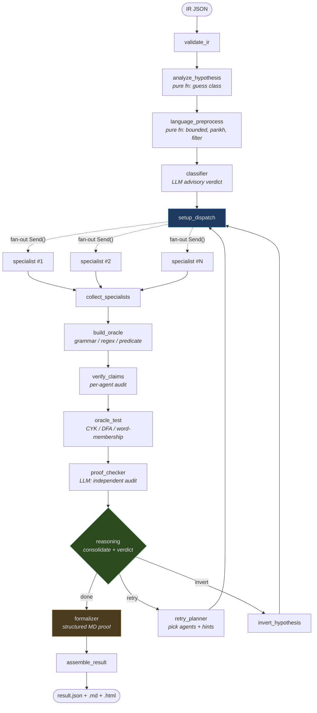
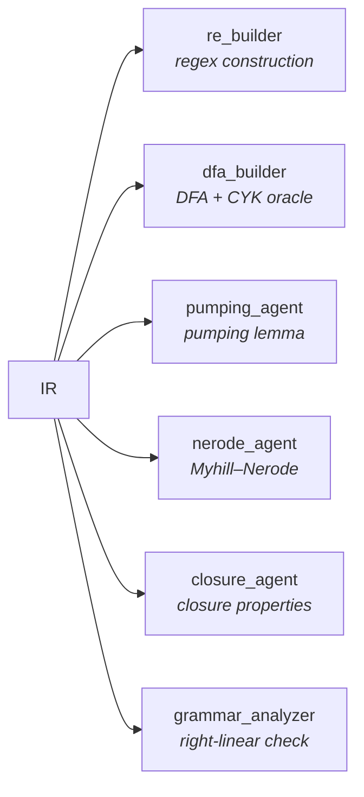
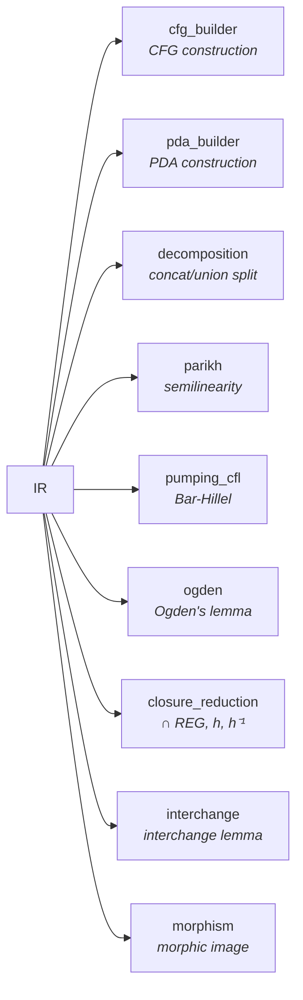
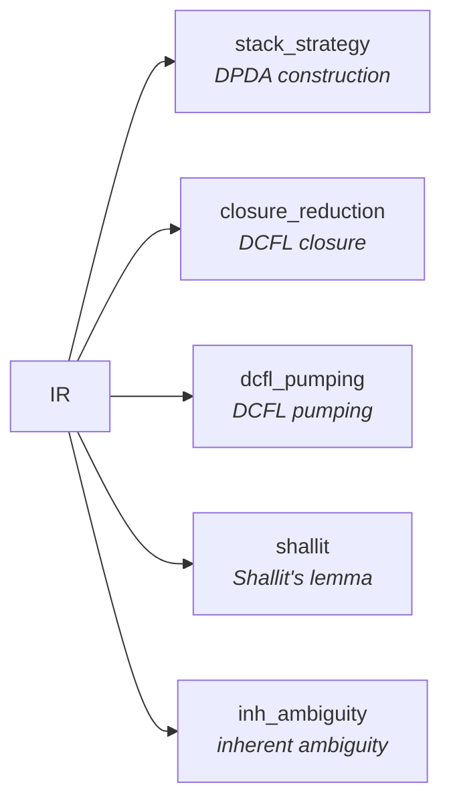
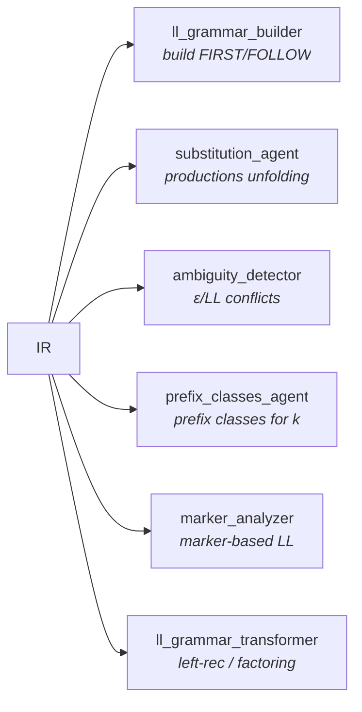

# TFL-automatisation

[](https://github.com/Ark2016/TFL-automatisation/actions/workflows/tests.yml)
[](LICENSE)
[](https://www.python.org/downloads/)
[](https://www.anthropic.com/claude)

Multi-agent pipelines for **Theory of Formal Languages** problems — classify a language and produce an exam-ready proof that it belongs (or does not belong) to a given complexity class. Four independent pipelines, one shared orchestration pattern, one local web UI.

> The system targets the formal languages course at **ИУ-9, МГТУ им. Баумана**. Inputs are Russian problem statements; outputs are structured Markdown / HTML / JSON reports with LaTeX-typeset proofs, grammar constructions, PDA diagrams, and case analyses.

---

## At a glance

| Pipeline | Language class | Agents | Flagship theorems |
|---|---|---|---|
| **REG** — `agent_system/` | Regular | 12 | Myhill–Nerode, pumping lemma (reg), closure under ⋃ ⋂ ¬ · * |
| **CFL** — `cfl_system/` | Context-free | 15 | Bar-Hillel pumping, Ogden's lemma, Parikh's theorem, interchange lemma, CFL ∩ REG |
| **DCFL** — `dcfl_system/` | Deterministic CFL | 8 | DCFL pumping, Shallit's lemma, inherent ambiguity |
| **LL** — `ll_system/` | LL(k) grammars | 10 | FIRST / FOLLOW, LL(k) conflict detection, left-recursion and factoring transforms |

Each pipeline runs its specialist agents **in parallel**, checks their artifacts against deterministic oracles, and fuses the evidence through a reasoning agent into a verdict and a structured report. REG and CFL additionally audit the chosen proof with an independent proof-checker agent. See [Architecture](#architecture) below.

---

## Quickstart

```bash
# One-time setup
python -m venv .venv
.venv/Scripts/activate        # or source .venv/bin/activate on *nix
pip install -e .                  # anthropic, langgraph, python-dotenv, ...
pip install pytest                # for the test suite
echo "ANTHROPIC_API_KEY=sk-..." > .env

# `pip install -e .` also registers console scripts, so any of these work
# from anywhere in the venv instead of `python -m ...`:
#   tfl-lab   tfl-reg   tfl-cfl   tfl-dcfl   tfl-ll

# Install Graphviz (for PDA state diagrams in HTML reports)
#   Windows: https://graphviz.org/download/ (add bin/ to PATH)
#   macOS:   brew install graphviz
#   Linux:   apt install graphviz
dot -V                        # sanity check

# Run the unified UI
.venv/Scripts/python -m ui_server.server --port 8765
# → open http://127.0.0.1:8765/
```

Or run a pipeline directly from the command line. All four orchestrators share one CLI contract — `<ir.json> --save DIR [--live] [--verbose]` — which is also what TFL Lab uses:

```bash
# Offline (no LLM, free) — exercises validation, oracles and fallback reasoning
.venv/Scripts/python -m cfl_system.orchestrator \
    cfl_system/examples/task11_ai_bj_between.json \
    --save cfl_system/examples/live_outputs/

# Live, cheap: every agent on Haiku (use this for testing)
TFL_MODEL_OVERRIDE=claude-haiku-4-5 .venv/Scripts/python -m cfl_system.orchestrator \
    cfl_system/examples/task11_ai_bj_between.json \
    --live --verbose --save cfl_system/examples/live_outputs/

# Live with the production models (Opus 5.5 / Sonnet 5 — real money)
.venv/Scripts/python -m cfl_system.orchestrator \
    cfl_system/examples/task11_ai_bj_between.json \
    --live --verbose --save cfl_system/examples/live_outputs/
```

Module per pipeline: `agent_system` (REG, run as `python -m agent_system`), `cfl_system.orchestrator`, `dcfl_system.orchestrator`, `ll_system.orchestrator`. `--mock DIR` replays recorded agent outputs instead of calling the API.

Artifacts land as `{ir_stem}_result.{json,md,html}` in the `--save` directory; the JSON has a top-level `verdict`. Exit code (cfl / dcfl / ll): `0` decided, `2` inconclusive, `1` failure; REG: `0` unless the pipeline failed.

---

## Architecture

Every pipeline is a **LangGraph `StateGraph`** built on the same pattern: specialists run concurrently via `Send()` fan-out, deterministic oracles check their artifacts, and a reasoning agent consolidates the evidence; disagreements trigger a selective retry. The diagram shows the full topology of **REG and CFL**; DCFL and LL use a subset (see [Pipeline differences](#pipeline-differences)).


```mermaid
flowchart TD
    IR([IR JSON]) --> V[validate_ir]
    V --> H[analyze_hypothesis<br/><i>pure fn: guess class</i>]
    H --> LP[language_preprocess<br/><i>pure fn: bounded, parikh, filter</i>]
    LP --> CL[classifier<br/><i>LLM advisory verdict</i>]
    CL --> D[setup_dispatch]

    D -.fan-out Send().-> S1[specialist #1]
    D -.fan-out Send().-> S2[specialist #2]
    D -.fan-out Send().-> SN[specialist #N]

    S1 --> CS[collect_specialists]
    S2 --> CS
    SN --> CS

    CS --> BO[build_oracle<br/><i>grammar / regex / predicate</i>]
    BO --> VC[verify_claims<br/><i>per-agent audit</i>]
    VC --> OT[oracle_test<br/><i>CYK / DFA / word-membership</i>]
    OT --> PC[proof_checker<br/><i>LLM: independent audit</i>]
    PC --> R{reasoning<br/><i>consolidate + verdict</i>}

    R -->|done| F[formalizer<br/><i>structured MD proof</i>]
    R -->|retry| RP[retry_planner<br/><i>pick agents + hints</i>]
    R -->|invert| INV[invert_hypothesis]

    RP --> D
    INV --> D

    F --> AR[assemble_result]
    AR --> END([result.json + .md + .html])

    style D fill:#1e3a5f,stroke:#4a90c0,color:#e6e8ec
    style R fill:#2d4a1e,stroke:#7acb9d,color:#e6e8ec
    style F fill:#4a3a1e,stroke:#d4a86a,color:#e6e8ec
```

`formalizer` is disabled by default (it's an extra Opus call to turn the reasoning agent's proof sketch into a
polished, structured Markdown proof). Enable it per run with `--formalize`, or for every run with
`TFL_FORMALIZATION=1` (also `true`/`yes`/`on`).

### Key properties

- **Fan-out parallelism.** All specialists are dispatched in one `Send()` burst and run concurrently in LangGraph's Pregel thread pool. End-to-end wall time ≈ max(specialist time), not sum.
- **Selective retry.** `retry_planner` can re-dispatch a subset of agents with specific hints (e.g. "try pumping word $a^p b^p c^p$ instead of $a^{2p}$") without re-running the whole pipeline.
- **Hypothesis inversion.** If every specialist under the current guess (`cfl` / `non_cfl`) fails, `invert_hypothesis` flips the hypothesis and restarts the dispatch. Bounded by `MAX_INVERSIONS`.
- **Error tracking.** `proof_verified: true` is set only if `proof_checker` actually ran and returned `status = verified` (REG / CFL). Agent errors, API failures, and JSON-parse problems are tracked in `state["errors"]` and surfaced in the final result.
- **Known limitations.** Claim verifiers that used to mark an agent claim `verified` for being merely well-formed now
  return `well_formed` (see trust taxonomy below); semantic (word-level) verification of the claim's content is only
  partial so far — implemented where an oracle already exists (CFL pumping/ogden/closure_reduction, DCFL pumping/Shallit,
  LL constructive/substitution/prefix_classes, REG pumping/Nerode), not yet for set_builder languages without a
  word-oracle. Treat a verdict's confidence per its `trust` level, not as a proof; see [`TODO.md`](TODO.md) §1 and
  [`docs/VERDICT_POLICY.md`](docs/VERDICT_POLICY.md) §4.

- **Trust taxonomy and confidence caps.** Every artifact/claim carries a `trust` level, and the orchestrator caps the
  final `confidence` accordingly (full rules: [`docs/VERDICT_POLICY.md`](docs/VERDICT_POLICY.md)):

  | trust | meaning | confidence cap |
  |---|---|---|
  | `verified` | deterministic, complete check (LL(k) table, Lean proof w/o `sorry`, regex/DFA regularity) | 0.98 |
  | `bounded_pass` | deterministic but bounded check (oracle membership up to length L, pumping checked for p ∈ {3,4,5}) | 0.85 |
  | `well_formed` | structure only — fields present, JSON/words parsed | 0.60 |
  | `not_verified` | check impossible or fields missing (verdict must be `inconclusive`/`uncertain`) | 0.40 |
  | unresolved `contradiction` (constructive vs. destructive evidence) | — | 0.50 |

  The result's `verdict_gate` block (`basis`, `contradiction`, `downgrades`, `confidence_cap`) records which trust
  levels backed the verdict and any downgrade the gate applied; renderers label evidence in words (`verified` /
  `bounded_pass` / `well_formed` / `refuted`) rather than a blanket green "verified" banner.

### Pipeline differences

| Stage | REG | CFL | DCFL | LL |
|---|:-:|:-:|:-:|:-:|
| Classifier (advisory) | ✓ | ✓ | ✓ | ✓ |
| Deterministic oracle | DFA / regex | CYK + PDA simulation | word sampler + verifier | FIRST_k / FOLLOW_k table |
| Claim verification | ✓ | ✓ | ✓ | ✓ |
| `proof_checker` agent | ✓ | ✓ | — | — |
| Retry | LLM planner | LLM planner | rule-based | reasoning-driven |
| Hypothesis inversion | ✓ | ✓ | — | — |
| Formalizer | Markdown (+ Lean stubs) | Markdown | renderer only | Markdown |

### Live-runner reliability layer

The [`LiveRunner`](cfl_system/orchestrator.py) (same pattern in cfl / dcfl / ll; REG uses [`LLMRunner`](agent_system/lib/llm_client.py)) handles the messy reality of calling a frontier LLM:

```
Opus response → _extract_json (3 strategies: whole / fenced / braces)
              ├─ success → return parsed dict
              └─ failure → Haiku repair (claude-haiku-4-5, ~$0.01, ~2s)
                         ├─ success → return parsed dict
                         └─ failure → Opus retry with detailed parse-error
                                      (position + context snippet + prior
                                       response excerpt) up to N times
                                      └─ final failure → agent_error dict
                                         with errors recorded in state
```

- **Streaming API** everywhere — non-streaming requests are rejected by the Anthropic SDK when `max_tokens × projected latency > 10 min`, and with adaptive thinking `max_tokens` has to cover reasoning + answer (64K).
- **Request parameters per model.** Opus 5.5 / Sonnet 5 run adaptive thinking steered by a per-agent `effort` level (`EFFORT` in each `config.py`) and reject `temperature`; only legacy models (Haiku 4.5) get `temperature`. See `LiveRunner._build_request_kwargs()`.
- **Cheap live test runs.** `TFL_MODEL_OVERRIDE=claude-haiku-4-5` forces every agent onto one model (all four pipelines); production models stay in `config.py`.
- **Refusals.** A safety-classifier decline (`stop_reason="refusal"`) becomes an `agent_error` immediately — no JSON repair or retry. Opus 5.x calls opt into the server-side refusal fallback (`fallbacks: "default"`, toggle `REFUSAL_FALLBACK`).

**Shared client (`agent_system/lib/llm_client.py`).** `cfl_system`/`dcfl_system`/`ll_system`'s `LiveRunner` are now
thin wrappers around one `AnthropicClient`: `build_request_kwargs()` builds the thinking/effort/temperature kwargs
described above, and `call()` does one streamed request and returns a typed `CallResult` (text, `stop_reason`,
model, usage, refusal info). API errors are typed — `FatalAPIError` (400/401/403/404, never retried) vs
`RetryableAPIError` (429/5xx/overloaded/a broken stream, retried with jittered backoff) — and concurrent calls
across all four pipelines share one process-wide semaphore, sized by the `TFL_MAX_CONCURRENCY` env var. A
`UsageTracker` accumulates tokens/cache-hit/cost per run (`as_dict()`); it is not yet wired into each pipeline's
top-level result JSON or CLI `--verbose` output (`TODO.md` §3).

**Structured outputs.** Agent responses are parsed primarily via the Messages API's `output_config.format`
(a closed per-agent JSON schema built by `build_agent_output_schema()` / `agent_output_schema.py` in each
system), which sidesteps the old "first `{` to last `}`" heuristic breaking on set-builder notation like
`{aⁿbⁿ | n≥0}` in prose. If the API rejects `output_config` itself (schema too large/unsupported), the call
transparently falls back to the legacy brace/fence extraction + Haiku repair path described above. Agents whose
output shape isn't a single fixed object (`input_parser`, `formalizer`, `ll_input_parser`) intentionally keep the
legacy prose-extraction path only.

---

## The four pipelines

### REG — `agent_system/`

Classify a regular-language problem and prove it (or disprove regularity). Specialists:


```mermaid
flowchart LR
    IR --> re[re_builder<br/><i>regex construction</i>]
    IR --> dfa[dfa_builder<br/><i>DFA + CYK oracle</i>]
    IR --> pump[pumping_agent<br/><i>pumping lemma</i>]
    IR --> ner[nerode_agent<br/><i>Myhill–Nerode</i>]
    IR --> clo[closure_agent<br/><i>closure properties</i>]
    IR --> gram[grammar_analyzer<br/><i>right-linear check</i>]
```

**Theorems / methods:**

- **Myhill–Nerode theorem.** Infinite-rank right-congruence → not regular.
- **Pumping lemma.** For non-regularity: choose word $z$, case analysis on partitions $z = uvw$.
- **Closure under boolean ops + concatenation + star.** Reduce unknown language to a known one via $L \cup R$, $L \cap R$, $\overline{L}$, $h^{-1}(L)$.
- **Grammar analysis.** Right-linear grammars generate exactly regular languages.

Formalizer can emit **Lean 4** proof stubs in addition to Markdown (optional, gated by availability of a Lean build).

### CFL — `cfl_system/`

Classify a context-free problem. Full specialist cast:


```mermaid
flowchart LR
    IR --> cfg[cfg_builder<br/><i>CFG construction</i>]
    IR --> pda[pda_builder<br/><i>PDA construction</i>]
    IR --> decomp[decomposition<br/><i>concat/union split</i>]
    IR --> pk[parikh<br/><i>semilinearity</i>]
    IR --> pump[pumping_cfl<br/><i>Bar-Hillel</i>]
    IR --> og[ogden<br/><i>Ogden's lemma</i>]
    IR --> clo[closure_reduction<br/><i>∩ REG, h, h⁻¹</i>]
    IR --> inter[interchange<br/><i>interchange lemma</i>]
    IR --> morph[morphism<br/><i>morphic image</i>]
```

**Theorems / methods:**

- **Bar-Hillel pumping lemma.** For non-CFL: every long enough $z \in L$ decomposes as $uvwxy$ with $|vwx| \le p$ and $|vx| \ge 1$, and $u v^i w x^i y \in L$ for all $i \ge 0$. Case split on where $vwx$ falls.
- **Ogden's lemma.** Strengthened pumping with marked positions — catches non-CFLs that survive plain pumping.
- **Parikh's theorem.** Parikh image of any CFL is semilinear (a finite union of linear sets). Non-semilinear image $\Rightarrow$ language is not CFL. Used to knock out languages like $\{a^n b^m : n = k^2\}$ via Ginsburg–Spanier.
- **Closure under ∩ REG.** If $L$ is CFL and $R$ is regular, $L \cap R$ is CFL. Contrapositive: intersect with a carefully chosen regex, then apply pumping to the simpler intersection.
- **Interchange lemma, morphism closure.** Fallback attacks when the above are inconclusive.
- **CYK oracle.** Pure-function membership test for the proposed CFG, validated against ≥3 positive and ≥3 negative words.

### DCFL — `dcfl_system/`

Classify a deterministic-context-free problem. Fewer specialists, each heavier:


```mermaid
flowchart LR
    IR --> stack[stack_strategy<br/><i>DPDA construction</i>]
    IR --> clo[closure_reduction<br/><i>DCFL closure</i>]
    IR --> pump[dcfl_pumping<br/><i>DCFL pumping</i>]
    IR --> shall[shallit<br/><i>Shallit's lemma</i>]
    IR --> amb[inh_ambiguity<br/><i>inherent ambiguity</i>]
```

**Theorems / methods** (formulations follow [`docs/THEORY.md`](docs/THEORY.md) §1 — the single source of truth for these lemma statements; change it there first, then in prompts):

- **DCFL pumping lemma (Yu).** Works with *two* words `xy`, `xz ∈ L` sharing a long prefix `x` (|x| > p, first(y) = first(z)). At least one of two conditions must hold: **(1)** a *pair* of factors `x₂, x₄` — the pair may sit **anywhere** in `x`, only the window `|x₂x₃x₄| ≤ p` is bounded — pumps synchronously in both `xy` and `xz`; **(2)** a single factor in the *last* `p` symbols of `x` pumps synchronously with matching factors of `y` and `z`. Refuting **both** for every decomposition shows `L` is not DCFL. (A single-factor reading of condition (1) is unsound — it would wrongly reject DCFLs like {aⁿbⁿcᵐ}.)
- **Shallit's theorem (Myhill–Nerode classes, [Sh] Thm 4.7.4).** If `L` is a DCFL, at least one Nerode-equivalence class of `L` is infinite. Contrapositive: if **all** classes are finite — every pair of distinct words separable by some suffix — then `L` is not DCFL. The argument only bites if the "dead" class `D = {x | no z: xz ∈ L}` is finite (usually `D = ∅`); an infinite dead class makes the theorem vacuously true and the method inapplicable (`not_applicable`), so it must be checked first.
- **Continuation lemma.** For a DCFL `L`, `haspref(L) = {xy | x, xy ∈ L, y ≠ ε}` and `L_$ = {x$y | x, xy ∈ L}` are also DCFL. Since DCFL ⊆ CFL and DCFLs are closed under ∩ REG, showing `L_$ ∩ R` is not CFL for some regular `R` proves `L` is not DCFL — a route around languages where direct pumping/Shallit arguments are awkward.
- **Inherent ambiguity.** Every DCFL has an unambiguous grammar, so an *inherently* ambiguous language (every CFG for it is ambiguous) is not DCFL. One ambiguous grammar proves nothing.
- **Closure under complement (DCFL-specific).** DCFLs are closed under complement but CFLs are not — useful discriminator.

### LL — `ll_system/`

Classify a grammar as LL(k) for some bounded k, detect conflicts, suggest transformations.


```mermaid
flowchart LR
    IR --> gb[ll_grammar_builder<br/><i>build FIRST/FOLLOW</i>]
    IR --> sub[substitution_agent<br/><i>productions unfolding</i>]
    IR --> amb[ambiguity_detector<br/><i>ε/LL conflicts</i>]
    IR --> pre[prefix_classes_agent<br/><i>prefix classes for k</i>]
    IR --> mark[marker_analyzer<br/><i>marker-based LL</i>]
    IR --> tr[ll_grammar_transformer<br/><i>left-rec / factoring</i>]
```

**Theorems / methods** (formulations follow [`docs/THEORY.md`](docs/THEORY.md) §3 — the single source of truth for these statements; change it there first, then in prompts):

- **FIRST / FOLLOW sets.** Computed per-nonterminal; the LL(1) test is $\text{FIRST}(\alpha_i) \cap \text{FIRST}(\alpha_j) = \emptyset$ for every pair of productions of the same nonterminal, plus a FOLLOW-disjointness condition when $\varepsilon$ is derivable.
- **LL(k) vs strong LL(k).** Strong LL(k) (SLL(k)) uses one *global* FOLLOW_k per nonterminal — a cheap sufficient test: SLL(k) ⇒ LL(k) (grammar), and the two grammar classes coincide at k = 1 but not for k ≥ 2 (e.g. `S → aAaa | bAba, A → b | ε` is LL(2) but not SLL(2); it first becomes SLL at k = 3). The oracle runs the cheap SLL(k) test first and, only if that fails at k ≥ 2, falls back to the full Aho–Ullman LL(k)-table test (local per-derivation FOLLOW sets, [AU] §5.1) before declaring "not LL(k)". At the **language** level the two classes coincide — every LL(k)-grammar has a structurally equivalent strong-LL(k)-grammar for the same language (Rosenkrantz–Stearns) — the distinction matters only between *grammars*, never between languages.
- **Closure.** LL languages are **not** closed under union or under intersection with a regular language: {aⁿbⁿ} and {aⁿcⁿ} are each LL(1), but their union is not LL(k) for any k (proved via the "branch" argument, §3.3); {aⁿw | w ∈ {b,c}ⁿ} is LL(1), yet intersecting it with the regular `a*b* ∪ a*c*` gives {aⁿbⁿ} ∪ {aⁿcⁿ}, which is not LL.
- **Grammar transformations.** Left-recursion elimination, left-factoring — makes a non-LL(1) grammar potentially LL(1), detected by `ll_grammar_transformer`.
- **First/Follow oracle.** Pure-function FIRST_k / FOLLOW_k computation used both for verification and as an independent source of truth against the LLM-proposed sets.
- **Word oracle for `set_builder` IRs.** `ll_system/lib/word_oracle.py` (`oracle_from_ll_ir`/`generate_words`) turns a
  `set_builder`-format language description (`nat`/`enum`/`word` variable domains, `rev(...)`, shared-variable
  constraints) into a membership predicate and a word generator, so the `prefix_classes` claim-verifier step can
  check membership semantically (`docs/VERDICT_POLICY.md` §4 step 2) instead of leaving trust at `well_formed`.
  Only Format 1 (`set_builder`) is covered this way; Format 2/3 (grammar given explicitly) still has no semantic
  check (`TODO.md` §1).

---

## Models and cost structure

All four pipelines use the same three-tier model stack:

| Role | Model (alias) | Rate (input / output) | Used by |
|---|---|---|---|
| Heavy reasoning | `claude-opus-5-5` (effort `high`) | $4 / $20 per MTok | All specialists, reasoning, proof_checker, formalizer |
| Fast structured | `claude-sonnet-5` (effort `medium`) | $2 / $10 per MTok | `classifier`, `retry_planner`, `input_parser` |
| JSON repair | `claude-haiku-4-5` | $1 / $5 per MTok | `_repair_json_with_haiku` hook in `LiveRunner` |

**Run cost.** On the previous stack (Opus 4.7 without thinking) a medium CFL problem (`task_w1bw2w3_ticket50.json`) cost **≈ $2–3**, a simple one **≈ $1**. Opus 5.5 is cheaper per token but thinks on every call, so these numbers need re-measuring; tune `EFFORT` per agent in each `config.py`. For development, `TFL_MODEL_OVERRIDE=claude-haiku-4-5` runs a full CFL pipeline (≈20 calls incl. a retry round) for well under $1.

> Opus 5.5 **always** uses adaptive thinking (it can't be disabled) and defaults to effort `medium` when none is sent, so every agent has an explicit level in `EFFORT`. Thinking tokens count toward `max_tokens`, hence `MAX_TOKENS = 64000` with streaming. Sampling parameters (`temperature`) are rejected with a 400 and are only sent to legacy models.

---

## TFL Lab — local web UI

[`ui_server/`](ui_server/) serves a single-page workspace for running any pipeline against any IR in the browser.

- **Sidebar:** project switcher (REG / CFL / DCFL / LL) + `examples/*.json` file list
- **Editor:** monospace IR editor with live JSON validator and line gutter
- **Run bar:** `Mock Run` (free, no LLM) and `Live Run` (gated by an explicit "I confirm API spend" checkbox with red border). Start the server with `TFL_MODEL_OVERRIDE=claude-haiku-4-5` to make live runs cheap.
- **Result pane:** four tabs — HTML (iframe of the rendered report with KaTeX + inline Graphviz SVG), JSON (formatted), Markdown (Preview ↔ Raw GitHub-style toggle), Log (streamed stderr, color-coded)

Backend is stdlib-only (`http.server` + `ThreadingHTTPServer`); frontend is vanilla JS (`static/app.js`, no inline `<script>`) + CDN-loaded [marked](https://marked.js.org/) + [KaTeX](https://katex.org/) (served from cdnjs, not jsdelivr, so a strict `script-src` can allow-list a single host) + [DOMPurify](https://github.com/cure53/DOMPurify) to sanitize the rendered Markdown before it goes into `innerHTML`. No framework, no build step.

**Runs are bounded, not fire-and-forget:** at most `MAX_CONCURRENT_RUNS` (default 2, `TFL_LAB_MAX_CONCURRENT_RUNS` env var) pipeline subprocesses run at once — further runs queue; each run is killed if it exceeds `RUN_TIMEOUT_SECONDS` (`--run-timeout`, default 1800 s); `POST /api/runs/<run_id>/cancel` cancels a queued or running run on demand from the UI.

Security model: binds to `127.0.0.1`, no auth. Requests are only answered for a loopback `Host` header (DNS-rebinding guard), `POST /api/run` requires a same-origin `application/json` request (no cross-site "no-cors" posts starting paid runs), files are served only by lookup in an index of the served directory, and a `Content-Security-Policy` header (script/style/connect restricted to `'self'` + cdnjs, no inline scripts, iframe results rendered with `sandbox`) limits the blast radius of a compromised or malicious IR/report.

```bash
.venv/Scripts/python -m ui_server.server --port 8765
# → http://127.0.0.1:8765/
.venv/Scripts/python -m ui_server.server --port 8765 --run-timeout 900
```

---

## Repository layout

```
.
├── agent_system/           # REG pipeline
│   ├── graph.py            # LangGraph StateGraph
│   ├── orchestrator.py     # Pipeline API + CLI (run as `python -m agent_system`)
│   ├── config.py           # models, effort, max_tokens per agent
│   ├── prompts/            # system prompts (one per agent)
│   ├── lib/                # LLM client, oracle, IR schema, renderer, word generator
│   ├── examples/           # task IRs
│   ├── templates/          # Lean 4 proof templates
│   └── tests/              # pytest suite
├── cfl_system/             # CFL pipeline (orchestrator.py = graph + LiveRunner + CLI)
├── dcfl_system/            # DCFL pipeline (same idea)
├── ll_system/              # LL pipeline (same idea)
├── ui_server/              # TFL Lab web UI
│   ├── server.py           # stdlib http.server
│   ├── static/index.html   # single-page frontend
│   └── tests/              # guards, path confinement, CLI contract
├── pumping_lemma/          # Legacy pumping-lemma checker (reference, not maintained)
├── reverse_morfism/        # Legacy inverse-homomorphism solver
├── pumping_len.py          # Min pumping-length finder for regex (standalone, see below)
├── TODO.md                 # backlog: open audit findings
├── .env                    # ANTHROPIC_API_KEY (git-ignored)
└── README.md               # you are here
```

Each pipeline follows the same module split — `config.py` (models, effort), `prompts/`, `lib/` (pure functions, no LLM), orchestrator — so reading one makes the others easy to follow.

`pumping_len.py` is a standalone script, unrelated to the four LLM pipelines above (no agents, no API calls): given a regex, it builds the minimal DFA (Thompson NFA → subset construction → Hopcroft minimization) and computes the *exact* minimum pumping length `p_min` per the Sipser definition — the smallest `p` such that every `w ∈ L` with `|w| ≥ p` has *some* split `w = xyz`, `|xy| ≤ p`, `|y| ≥ 1`, with `xyⁱz ∈ L` for all `i ≥ 0`. This is computed by an exact search (not the "shortest word with a repeated state" heuristic, which is only a sufficient, not necessary, condition and under-counts `p_min` on languages like `a*|bbbb`), so it also handles the empty and finite-language edge cases without special-casing. Regex syntax: `a-z`/`0-9` symbols, `|`, `*`, parentheses, `ε` or `()` for the empty-string language, `∅` for the empty language.

```bash
.venv/Scripts/python pumping_len.py "a*|bbbb" --witness   # p_min('a*|bbbb') = 5, plus a counterexample at p=4
.venv/Scripts/python pumping_len.py "a*|bbbb" --json       # machine-readable output
.venv/Scripts/python -m pytest tests -q                    # its own test suite (incl. brute-force cross-checks)
```

---

## Tests

Pure-function modules have pytest coverage; LLM-driven layers are covered by mock-mode integration tests and by request-building tests against a mocked Anthropic client. No test calls the API.

```bash
.venv/Scripts/python -m pytest agent_system/tests cfl_system/tests \
                               dcfl_system/tests ll_system/tests ui_server/tests -q
# → 1383 passed, 3 skipped
```

The 3 skipped tests type-check Lean 4 templates and need Docker with the `tfl-lean4` image.

> Run pytest with these explicit paths. A bare `pytest` from the repo root also collects the legacy `pumping_lemma/tests`, which **call the real API** with the key from `.env`.

---

## `tfl-eval` — accuracy and calibration over an eval set

`tfl_eval/` runs the eval set described in [`docs/EVAL_SET.md`](docs/EVAL_SET.md) (73 tasks across all four
pipelines, `agent_system|cfl_system|dcfl_system|ll_system/examples/eval/*.json` plus a handful of existing
example IRs, indexed by `tfl_eval/manifest.json`) and reports how well each pipeline's verdict matches the
expected one.

```bash
tfl-eval --systems cfl,ll                       # mock mode (default): free, no API calls
tfl-eval --systems cfl,ll --ids cfl-01,cfl-02    # narrow to specific eval-set ids
tfl-eval --live                                  # real API calls — only on request; forces Haiku unless overridden
```

Without `--live`, a task runs through its pipeline's `MockRunner` when the manifest names an existing mock
fixture; otherwise it is reported `skipped` rather than guessed at. Metrics (`tfl_eval/metrics.py`): overall /
per-system / trap-task accuracy, a Brier score for confidence calibration, the inconclusive rate, and the
"false confident wrong" rate (confidence ≥ 0.6 but incorrect verdict). Results land under `.tfl_lab_runs/evals/`.
This is what lets a prompt or model change be measured rather than eyeballed (`TODO.md` §7).

---

## External dependencies

- **Python 3.12+** — `anthropic>=0.77`, `langgraph`, `python-dotenv` (declared in `pyproject.toml`), `pytest` for tests
- **Graphviz `dot` binary** — rendering PDA state diagrams as inline SVG in HTML reports. Falls back to [Mermaid](https://mermaid.js.org/) via CDN if `dot` is absent. See [`cfl_system/CLAUDE.md`](cfl_system/CLAUDE.md) for install notes.
- **Lean 4** (optional) — REG pipeline can emit Lean stubs via `agent_system/templates/*.lean`.
- **Anthropic API key** in `.env` for `--live` runs. Offline / mock mode needs no key.

---

## Design non-goals

- **Not a solver for arbitrary undecidable questions.** All four pipelines assume the input is a well-posed problem from the exam problem set — the class being tested is decidable or admits a standard proof technique.
- **Not a formal proof assistant.** Proofs are natural-language Markdown; the `proof_checker` agent is an independent LLM audit, not a machine-checked verification. Lean stubs (REG only) are the closest this project gets to machine-checked proofs, and even those are opt-in.
- **No multi-user state.** TFL Lab binds to `127.0.0.1` and has no auth. It is a single-user research tool.

---

## License

[MIT](LICENSE) — use, modify, distribute freely. Provided as-is, with no warranty.

## Acknowledgements

Built for the Theory of Formal Languages course at **МГТУ им. Н.Э. Баумана, ИУ-9**.

Powered by [Claude](https://www.anthropic.com/claude) (Opus 5.5 / Sonnet 5 / Haiku 4.5) via the Anthropic API, orchestrated through [LangGraph](https://langchain-ai.github.io/langgraph/).
